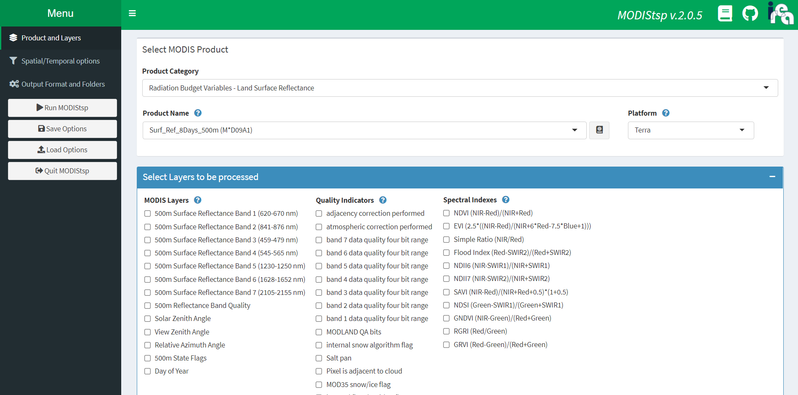
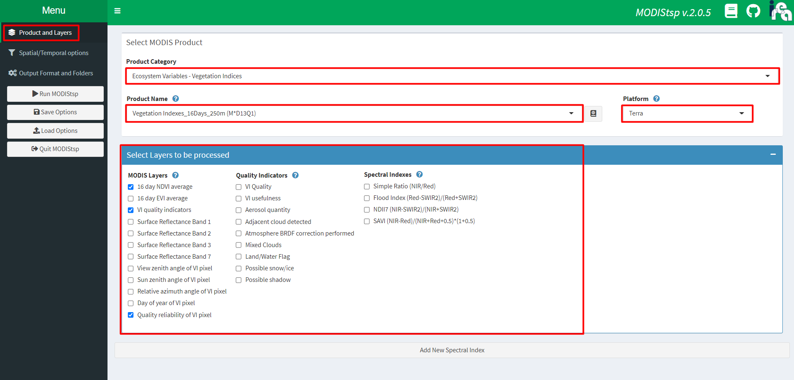
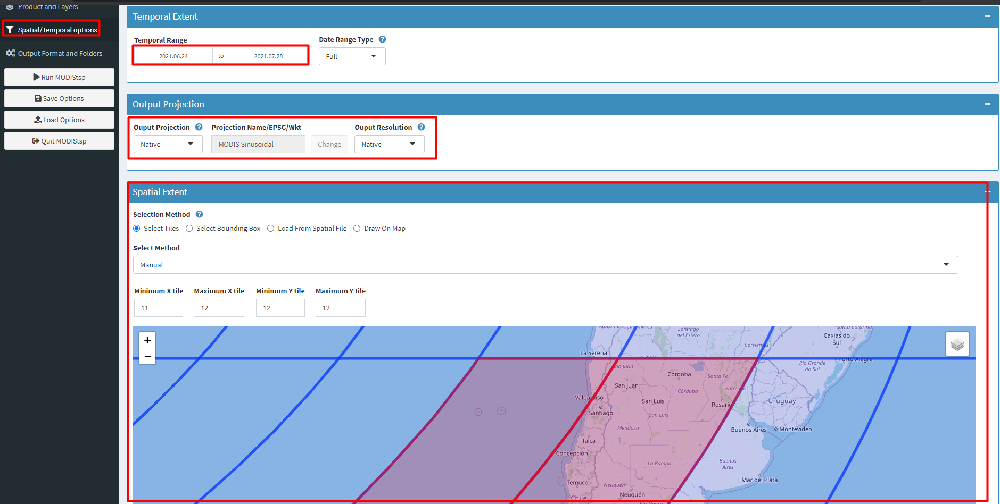
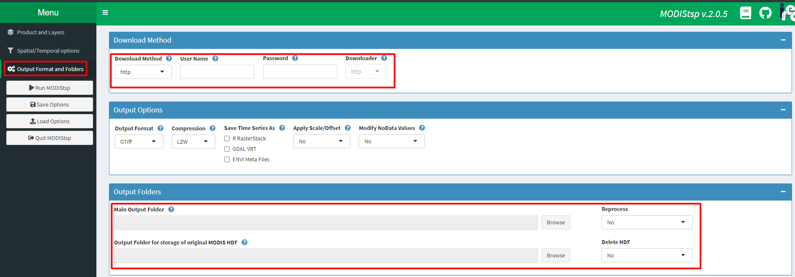
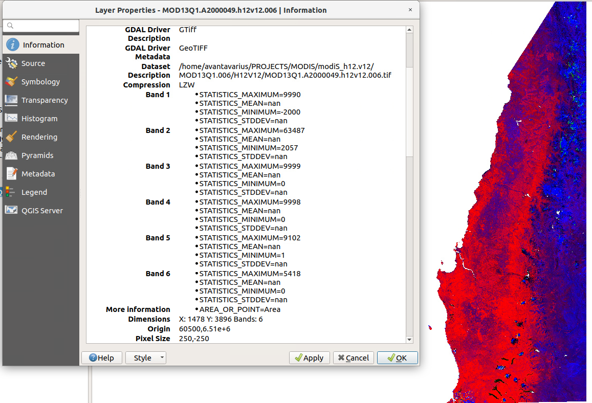

```{r setup, include=FALSE}
options(htmltools.dir.version = FALSE)
knitr::opts_chunk$set(echo = TRUE)
library(DT)
library(magrittr)
```
<style>
body {
text-align: justify}
details:hover { cursor: pointer }
</style>

<center>

</center>

# Introducción

Como insumo para la obtención de índices de vegetación consistentes en el tiempo, se emplean las imágenes del producto [MOD13Q1 (versión 6)](https://lpdaac.usgs.gov/products/mod13q1v006/), que presentan índices de vegetación a nivel de pixel con una resolución espacial de 250 m y una resolución temporal de 16 días para cada producto, y cada 8 días con los productos combinados. Dentro de cada set de datos se presentan dos índices correspondientes al Índice de Vegetación de Diferencia Normalizada (NDVI, en inglés) y el Índice de Vegetación Mejorado (EVI, en inglés), además de bandas de reflectancia superficial y bandas para aplicación de filtros de calidad.

A partir de la búsqueda de información se establece que el área de estudio está cubierta por dos tile MODIS correspondientes a los tiles H12-V12 y H11-V12, los cuales deben ser descargados y procesados para obtener los insumos para la reconstrucción fenológica.

A continuación se detalla el procedimiento y código necesario para obtener los datos necesarios y reproducir la reconstrucción fenológica con datos MODIS para el área GEF Montaña


## 1.- Descarga de datos para procesamiento

Para descargar los datos MODIS en formato *HDF*, se puede recurrir a diferentes plataformas (EarthExplorer, LPDAAC, Engine, etc.). Para el flujo de trabajo propuesto se empleó la librería [**MODIStsp**](https://cran.r-project.org/package=MODIStsp) que permite la selección de los productos de forma más estable en el tiempo a diferencia de otras librerías similares.

El primer paso consiste en instalar la librería y cargarla en nuestro entorno de trabajo de la siguiente forma

```{r eval=F}
install.packages('MODIStsp')#instalar solo una vez

#cargar librería
library(MODIStsp)
```

Una vez cargada la librería, ejecute la función `MODIStsp()` para abrir la interfaz para selección de productos disponibles. Esta interfaz nos permitirá configurar cualquier parámetro adicional de las salidas a descargar.

<center></center>

Es importante disponer de una cuenta en [Earthdata](https://urs.earthdata.nasa.gov/) para poder acceder a toda la información ofrecida por los diferentes servidores.

Para dar paso a la descarga de los datos primero debe seleccionar las opciones correspondientes en la sección **Product and layers** y elegir las bandas de interés.

<center></center>

Seleccionada la información de interés, debe dirigirse a la pestaña **Spatial/temporal options** donde dispone de opciones para elegir el periodo de interés, tiles además de resolución y sistema de referencia de salida para los TIF. Considere que puede agregar una región de interés o seleccionar manualmente con un dibujo si no conoce los tiles de su zona de estudio.

<center></center>

Finalmente, en la sección **Output Format and folders** debe ingresar su usuario y password para habilitar la descarga además de direccionar los archivos de salida a sus respectivas carpetas. **Imporante:** marque la opción de no borrar los HDF que serán empleados en los siguientes pasos. Una vez configurado todo, de click en el botón **Run MODIStsp** y espere que el proceso finalice.

<center></center>


## 2.- Procesamiento y preparación de datos

Si bien MODIStsp nos permite extraer de forma directa la información en GeoTIFF desde los HDF descargados de los productos MOD13Q1, en algunas áreas existen ciertas inconsistencias con el tamaño original del pixel y con la alineación de las imágenes entre otros aspectos relevantes para el análisis de series de tiempo.

Debido a esto, el flujo de procesamiento propuesto se genera desde los HDF originales y gran parte del trabajo se realiza empleando el motor de GDAL para asegurar consistencia entre todas las capas espaciales generadas.

### 2.1.- Extracción y reproyección de bandas de interés

Para el proceso de extracción de bandas y reproyección se considera el uso del CRS UTM 19S WGS84 como sistema de referencia espacial de salida para los archivos GeoTIFF. Para adecuar la extensión adecuada de cada tile empleado se emplea la tabla de nombre **01_tiles_ext.csv** que almacena las extensiones para el territorio nacional de cada tile.

```{r echo=FALSE}
read.csv('01_tiles_ext.csv',header = T,sep = ',') %>% 
  datatable(class = 'cell-border stripe',rownames = FALSE,
            options = list(dom = 't', scrollX = TRUE,fixedColumns = TRUE))
```


Además de las extensiones, se requiere de la creación de una lista con los archivos HDF a procesar y extraer quedando la primera sección de nuestro script de procesamiento con esta estructura:

```{r eval=F}
##Extracción y reproyección MOD13Q1
#------------------------------------
library(rgdal)
library(magrittr)
library(gdalUtils)
library(raster)
library(sf)
#------------------------------------
#leer extent para el tile de interés
coor <- read.csv("directorio/01_tiles_ext.csv")[4,] #cambie el número para seleccionar tile de interés
ext <- c(coor$xmin, coor$xmax, coor$ymax, coor$ymin)

#creación de lista para 1 tile
hdf.dir <- "directorio/MOD13Q1.006/" #modifique directorio según el nombre de su carpeta
hdf.list <- list.files(path = hdf.dir,pattern = glob2rx("*.h12v12.*.hdf"),full.names = T) #lista para 1 tile
#considere modificar *.h12v12.* por su tile de interés
```

Con la lista generada, se debe crear un identificador con información del HDF para crear un nombre de salida para cada archivo en formato GeoTIFF. Además, debe incorporar los parámetros para el proceso de reproyección como aparece en el ejemplo.

```{r eval=F}
#sceneID para TIF y nombre de archivo
sceneID <- paste(substr(hdf.list, 62,89),".tif",sep="")# los valores 62 y 89 cambiarán según su propia lista

sceneID[1]#corrobore que el Id de la escena sea el que usted requiere ej  MOD13Q1.A2000049.h12v12.006.tif

#nobres de salida con directorio de guardado
outnames<-paste("directorio/H12V12/",sceneID,sep="")
outnames[1] #corrobore que esté direccionando a la carpeta correcta y que el nombre sea el que corresponde

# Definición de parámetros de proyección
# original
oldproj <- "+proj=sinu +lon_0=0 +x_0=0 +y_0=0 +a=6371007.181 +b=6371007.181 +units=m +no_defs"
#reproyección
newproj <- "+proj=utm +zone=19 +south +ellps=WGS84 +units=m +no_defs"
```

Esta configuración nos permite armar el ciclo de reproyección y extracción de las bandas de interés para los archivos dentro de la lista. Considere que dentro del ciclo de ejemplo se utilizan solo las bandas espectrales, el NDVI y la banda de quality assesment de detalle.

```{r eval=F}
#cliclo para reproyección y extracción
for (i in 1:length(hdf.list)) {
  #NDVI
  gdal_translate(hdf.list[i], 'b1.tif', sd_index=1, overwrite=T)
  gdalwarp("b1.tif","b1_UTMWGS84.tif",s_srs=oldproj,
           t_srs=newproj, te=ext,tr=c(250,250),
           overwrite=T)
  
  file.remove("b1.tif") #Borra temporal
  b1 <- raster("b1_UTMWGS84.tif")
  
  #pixel QA
  gdal_translate(hdf.list[i], 'b3.tif', sd_index=3, overwrite=T)
  gdalwarp("b3.tif","b3_UTMWGS84.tif",s_srs=oldproj,
           t_srs=newproj, te=ext,tr=c(250,250),
           overwrite=T)
  
  file.remove("b3.tif") #Borra temporal
  b3 <- raster("b3_UTMWGS84.tif")
  
  #RED
  gdal_translate(hdf.list[i], 'b4.tif', sd_index=4, overwrite=T)
  gdalwarp("b4.tif","b4_UTMWGS84.tif",s_srs=oldproj,
           t_srs=newproj, te=ext,tr=c(250,250),
           overwrite=T)
  
  file.remove("b4.tif") #Borra temporal
  b4 <- raster("b4_UTMWGS84.tif")
  
  #NIR
  gdal_translate(hdf.list[i], 'b5.tif', sd_index=5, overwrite=T)
  gdalwarp("b5.tif","b5_UTMWGS84.tif",s_srs=oldproj,
           t_srs=newproj, te=ext,tr=c(250,250),
           overwrite=T)
  
  file.remove("b5.tif") #Borra temporal
  b5 <- raster("b5_UTMWGS84.tif")
  
  #BLUE
  gdal_translate(hdf.list[i], 'b6.tif', sd_index=6, overwrite=T)
  gdalwarp("b6.tif","b6_UTMWGS84.tif",s_srs=oldproj,
           t_srs=newproj, te=ext,tr=c(250,250),
           overwrite=T)
  
  file.remove("b6.tif") #Borra temporal
  b6 <- raster("b6_UTMWGS84.tif")
  
  #MIR
  gdal_translate(hdf.list[i], 'b7.tif', sd_index=7, overwrite=T)
  gdalwarp("b7.tif","b7_UTMWGS84.tif",s_srs=oldproj,
           t_srs=newproj, te=ext,tr=c(250,250),
           overwrite=T)
  
  file.remove("b7.tif") #Borra temporal
  b7 <- raster("b7_UTMWGS84.tif")
  
  #Creación raster stack
  st <- stack(b1,b3,b4,b5,b6,b7)
  
  writeRaster(st, filename=outnames[i], format='GTiff', overwrite=T) #guarda archivo
  
  ##Borra archivos intermedios
  file.remove("b3_UTMWGS84.tif")
  file.remove("b1_UTMWGS84.tif")
  file.remove("b4_UTMWGS84.tif")
  file.remove("b5_UTMWGS84.tif")
  file.remove("b6_UTMWGS84.tif")
  file.remove("b7_UTMWGS84.tif")
  
  print(paste('IMAGEN',i,'LISTA!'))
}
```

<center></center>
<center>Ejemplo resultado para tile H12V12 18.02.2000</center>

### 2.2.- Corte a extensión del área de estudio

Ahora que las imágenes ya están reproyectadas, se deben ajustar a la extensión rectangular del área de estudio GEF Montaña. Para esto, genere una lista con los archivos reproyectados y cargue el vector de nombre **extent_studySite.gpkg**


```{r eval=F}
#Inputs para corte y enmascarado de archivos
##Directorio y GeoTIFF's reproyectados
vi.dir <- "directorio/H12V12/"#directorio a archivos reproyectados
vi.list <- list.files(path = vi.dir,pattern = glob2rx("*.tif"),full.names = T)#lista, considere la carpeta del tile correspondiente

mascara <- read_sf("directorio/extent_studySite.gpkg") #area de interés

```

Al igual que en el proceso de reproyección, se debe generar una lista con los nombres de salida para cada una de las bandas individuales empleando la lista de archivos (**vi.list**).

```{r eval=F}

#Creación de nombres de las bandas
base_name <- substr(vi.list,69,95) #los valores 69 y 95 pueden cambiar según el directorio donde guarde los archivos

base.name[1] #compruebe que el nombre sea el adecuado ej MOD13Q1.A2000049.h12v12.006

#creación de nombres de salida para cada banda
outname.ndvi <- paste("directorio/H12V12/cropped/",base_name, "_NDVI.tif",sep = "")#nombres para NDVI
outname.QA <- paste("directorio/H12V12/cropped/",base_name, "_QA.tif",sep = "")#nombres para QA
outname.red <- paste("directorio/H12V12/cropped/",base_name, "_RED.tif",sep = "")#nombres para RED
outname.nir <- paste("directorio/H12V12/cropped/",base_name, "_NIR.tif",sep = "")#nombres para NIR
outname.blue <- paste("directorio/H12V12/cropped/",base_name, "_BLUE.tif",sep = "")#nombres para BLUE
outname.mir <- paste("directorio/H12V12/cropped/",base_name, "_MIR.tif",sep = "")#nombres para MIR

```

Realizado este proceso de creación de nombres, se puede proceder a ejecutar el ciclo de corte y enmascarado para guardar la información ajustada al área de estudio.

```{r eval=F}
#ciclo para corte y enmascarado
for(i in 1:length(vi.list)) {
  
  ndvi <- raster(vi.list[i],band=1)#selecccionando ndvi
  qa <- raster(vi.list[i],band=2)#selecccionando QA
  red <- raster(vi.list[i],band=3)#selecccionando RED
  nir <- raster(vi.list[i],band=4)#selecccionando NIR
  blue <- raster(vi.list[i],band=5)#selecccionando BLUE
  mir <- raster(vi.list[i],band=6)#selecccionando MIR
  
  ##Corte y enmascarado
  ndvi.m <- ndvi %>% crop(mascara) %>% mask(mascara)
  qa.m <- qa %>% crop(mascara) %>% mask(mascara)
  red.m <- red %>% crop(mascara) %>% mask(mascara)
  nir.m <- nir %>% crop(mascara) %>% mask(mascara)
  blue.m <- blue %>% crop(mascara) %>% mask(mascara)
  mir.m <- mir %>% crop(mascara) %>% mask(mascara)
  
  
  ## SAVE ON DISK
  
  writeRaster(ndvi.m,outname.ndvi[i],format="GTiff",datatype="INT2S",overwrite=T)
  writeRaster(red.m,outname.red[i],format="GTiff",datatype="INT2S",overwrite=T)
  writeRaster(nir.m,outname.nir[i],format="GTiff",datatype="INT2S",overwrite=T)
  writeRaster(blue.m,outname.blue[i],format="GTiff",datatype="INT2S",overwrite=T)
  writeRaster(mir.m,outname.mir[i],format="GTiff",datatype="INT2S",overwrite=T)
  writeRaster(qa.m,outname.QA[i],format="GTiff",datatype="INT2S",overwrite=T)
  
  print(paste('IMAGEN',i,'LISTA!'))
}
```

### 2.3.- Aplicación de bandas de calidad

## 3.- Cálculo de fenología empleando **[npphen](https://CRAN.R-project.org/package=npphen)**

### 3.1.- Cálculo de fenométricas básicas

### 3.2.- Cálculo de anomalías de NDVI


