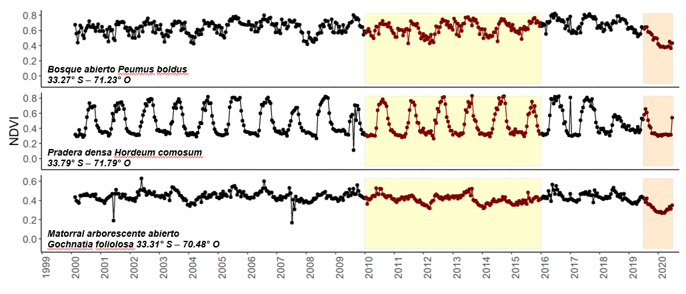
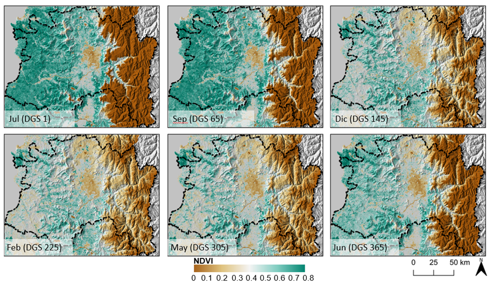
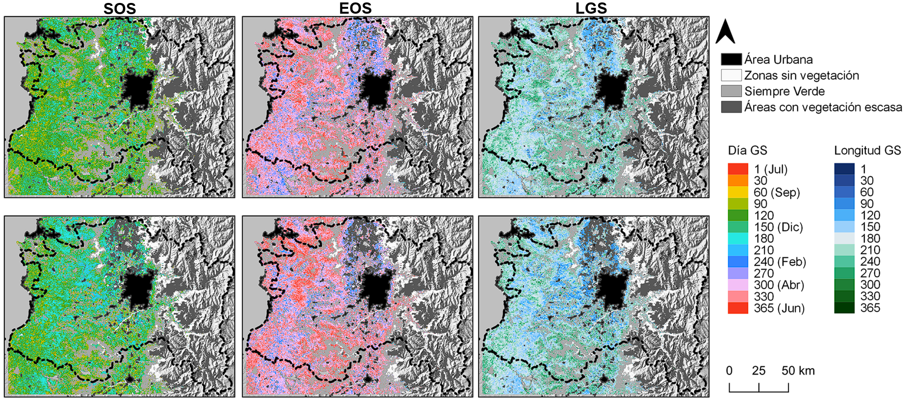
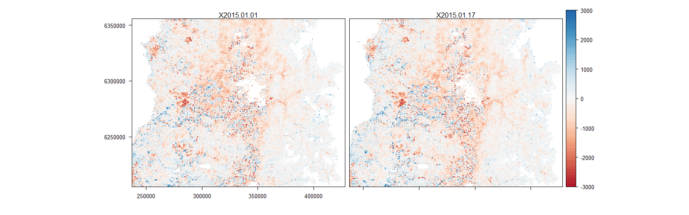

```{r setup, include=FALSE}
options(htmltools.dir.version = FALSE)
knitr::opts_chunk$set(echo = TRUE)
library(DT)
library(magrittr)
```
<style>
body {
text-align: justify}
details:hover { cursor: pointer }
</style>

<center>

</center>

# Introducción

Como insumo para la obtención de índices de vegetación consistentes en el tiempo, se emplean las imágenes del producto [MOD13Q1 (versión 6)](https://lpdaac.usgs.gov/products/mod13q1v006/), que presentan índices de vegetación a nivel de pixel con una resolución espacial de 250 m y una resolución temporal de 16 días para cada producto, y cada 8 días con los productos combinados. Dentro de cada set de datos se presentan dos índices correspondientes al Índice de Vegetación de Diferencia Normalizada (NDVI, en inglés) y el Índice de Vegetación Mejorado (EVI, en inglés), además de bandas de reflectancia superficial y bandas para aplicación de filtros de calidad.

A partir de la búsqueda de información se establece que el área de estudio está cubierta por dos tile MODIS correspondientes a los tiles H12-V12 y H11-V12, los cuales deben ser descargados y procesados para obtener los insumos para la reconstrucción fenológica.

A continuación se detalla el procedimiento y código necesario para obtener los datos necesarios y reproducir la reconstrucción fenológica con datos MODIS para el área GEF Montaña


## 1.- Descarga de datos para procesamiento

Para descargar los datos MODIS en formato *HDF*, se puede recurrir a diferentes plataformas (EarthExplorer, LPDAAC, Engine, etc.). Para el flujo de trabajo propuesto se empleó la librería [**MODIStsp**](https://cran.r-project.org/package=MODIStsp) que permite la selección de los productos de forma más estable en el tiempo a diferencia de otras librerías similares.

El primer paso consiste en instalar la librería y cargarla en nuestro entorno de trabajo de la siguiente forma

```{r eval=F}
install.packages('MODIStsp')#instalar solo una vez

#cargar librería
library(MODIStsp)
```

Una vez cargada la librería, ejecute la función `MODIStsp()` para abrir la interfaz para selección de productos disponibles. Esta interfaz nos permitirá configurar cualquier parámetro adicional de las salidas a descargar.

<center></center>

Es importante disponer de una cuenta en [Earthdata](https://urs.earthdata.nasa.gov/) para poder acceder a toda la información ofrecida por los diferentes servidores.

Para dar paso a la descarga de los datos primero debe seleccionar las opciones correspondientes en la sección **Product and layers** y elegir las bandas de interés.

<center></center>

Seleccionada la información de interés, debe dirigirse a la pestaña **Spatial/temporal options** donde dispone de opciones para elegir el periodo de interés, tiles además de resolución y sistema de referencia de salida para los TIF. Considere que puede agregar una región de interés o seleccionar manualmente con un dibujo si no conoce los tiles de su zona de estudio.

<center></center>

Finalmente, en la sección **Output Format and folders** debe ingresar su usuario y password para habilitar la descarga además de direccionar los archivos de salida a sus respectivas carpetas. **Imporante:** marque la opción de no borrar los HDF que serán empleados en los siguientes pasos. Una vez configurado todo, de click en el botón **Run MODIStsp** y espere que el proceso finalice.

<center></center>


## 2.- Procesamiento y preparación de datos

Si bien MODIStsp nos permite extraer de forma directa la información en GeoTIFF desde los HDF descargados de los productos MOD13Q1, en algunas áreas existen ciertas inconsistencias con el tamaño original del pixel y con la alineación de las imágenes entre otros aspectos relevantes para el análisis de series de tiempo.

Debido a esto, el flujo de procesamiento propuesto se genera desde los HDF originales y gran parte del trabajo se realiza empleando el motor de GDAL para asegurar consistencia entre todas las capas espaciales generadas.

### 2.1.- Extracción y reproyección de bandas de interés

Para el proceso de extracción de bandas y reproyección se considera el uso del CRS UTM 19S WGS84 como sistema de referencia espacial de salida para los archivos GeoTIFF. Para adecuar la extensión adecuada de cada tile empleado se emplea la tabla de nombre **01_tiles_ext.csv** que almacena las extensiones para el territorio nacional de cada tile.

```{r echo=FALSE}
read.csv('01_tiles_ext.csv',header = T,sep = ',') %>% 
  datatable(class = 'cell-border stripe',rownames = FALSE,
            options = list(dom = 't', scrollX = TRUE,fixedColumns = TRUE))
```


Además de las extensiones, se requiere de la creación de una lista con los archivos HDF a procesar y extraer quedando la primera sección de nuestro script de procesamiento con esta estructura:

```{r eval=F}
##Extracción y reproyección MOD13Q1
#------------------------------------
library(rgdal)
library(magrittr)
library(gdalUtils)
library(raster)
library(sf)
#------------------------------------
#leer extent para el tile de interés
coor <- read.csv("directorio/01_tiles_ext.csv")[4,] #cambie el número para seleccionar tile de interés
ext <- c(coor$xmin, coor$xmax, coor$ymax, coor$ymin)

#creación de lista para 1 tile
hdf.dir <- "directorio/MOD13Q1.006/" #modifique directorio según el nombre de su carpeta
hdf.list <- list.files(path = hdf.dir,pattern = glob2rx("*.h12v12.*.hdf"),full.names = T) #lista para 1 tile
#considere modificar *.h12v12.* por su tile de interés
```

Con la lista generada, se debe crear un identificador con información del HDF para crear un nombre de salida para cada archivo en formato GeoTIFF. Además, debe incorporar los parámetros para el proceso de reproyección como aparece en el ejemplo.

```{r eval=F}
#sceneID para TIF y nombre de archivo
sceneID <- paste(substr(hdf.list, 62,89),".tif",sep="")# los valores 62 y 89 cambiarán según su propia lista

sceneID[1]#corrobore que el Id de la escena sea el que usted requiere ej  MOD13Q1.A2000049.h12v12.006.tif

#nobres de salida con directorio de guardado
outnames<-paste("directorio/H12V12/",sceneID,sep="")
outnames[1] #corrobore que esté direccionando a la carpeta correcta y que el nombre sea el que corresponde

# Definición de parámetros de proyección
# original
oldproj <- "+proj=sinu +lon_0=0 +x_0=0 +y_0=0 +a=6371007.181 +b=6371007.181 +units=m +no_defs"
#reproyección
newproj <- "+proj=utm +zone=19 +south +ellps=WGS84 +units=m +no_defs"
```

Esta configuración nos permite armar el ciclo de reproyección y extracción de las bandas de interés para los archivos dentro de la lista. Considere que dentro del ciclo de ejemplo se utilizan solo las bandas espectrales, el NDVI y la banda de quality assesment de detalle.

```{r eval=F}
#cliclo para reproyección y extracción
for (i in 1:length(hdf.list)) {
  #NDVI
  gdal_translate(hdf.list[i], 'b1.tif', sd_index=1, overwrite=T)
  gdalwarp("b1.tif","b1_UTMWGS84.tif",s_srs=oldproj,
           t_srs=newproj, te=ext,tr=c(250,250),
           overwrite=T)
  
  file.remove("b1.tif") #Borra temporal
  b1 <- raster("b1_UTMWGS84.tif")
  
  #pixel QA
  gdal_translate(hdf.list[i], 'b3.tif', sd_index=3, overwrite=T)
  gdalwarp("b3.tif","b3_UTMWGS84.tif",s_srs=oldproj,
           t_srs=newproj, te=ext,tr=c(250,250),
           overwrite=T)
  
  file.remove("b3.tif") #Borra temporal
  b3 <- raster("b3_UTMWGS84.tif")
  
  #RED
  gdal_translate(hdf.list[i], 'b4.tif', sd_index=4, overwrite=T)
  gdalwarp("b4.tif","b4_UTMWGS84.tif",s_srs=oldproj,
           t_srs=newproj, te=ext,tr=c(250,250),
           overwrite=T)
  
  file.remove("b4.tif") #Borra temporal
  b4 <- raster("b4_UTMWGS84.tif")
  
  #NIR
  gdal_translate(hdf.list[i], 'b5.tif', sd_index=5, overwrite=T)
  gdalwarp("b5.tif","b5_UTMWGS84.tif",s_srs=oldproj,
           t_srs=newproj, te=ext,tr=c(250,250),
           overwrite=T)
  
  file.remove("b5.tif") #Borra temporal
  b5 <- raster("b5_UTMWGS84.tif")
  
  #BLUE
  gdal_translate(hdf.list[i], 'b6.tif', sd_index=6, overwrite=T)
  gdalwarp("b6.tif","b6_UTMWGS84.tif",s_srs=oldproj,
           t_srs=newproj, te=ext,tr=c(250,250),
           overwrite=T)
  
  file.remove("b6.tif") #Borra temporal
  b6 <- raster("b6_UTMWGS84.tif")
  
  #MIR
  gdal_translate(hdf.list[i], 'b7.tif', sd_index=7, overwrite=T)
  gdalwarp("b7.tif","b7_UTMWGS84.tif",s_srs=oldproj,
           t_srs=newproj, te=ext,tr=c(250,250),
           overwrite=T)
  
  file.remove("b7.tif") #Borra temporal
  b7 <- raster("b7_UTMWGS84.tif")
  
  #Creación raster stack
  st <- stack(b1,b3,b4,b5,b6,b7)
  
  writeRaster(st, filename=outnames[i], format='GTiff', overwrite=T) #guarda archivo
  
  ##Borra archivos intermedios
  file.remove("b3_UTMWGS84.tif")
  file.remove("b1_UTMWGS84.tif")
  file.remove("b4_UTMWGS84.tif")
  file.remove("b5_UTMWGS84.tif")
  file.remove("b6_UTMWGS84.tif")
  file.remove("b7_UTMWGS84.tif")
  
  print(paste('IMAGEN',i,'LISTA!'))
}
```

<center></center>
<center>Ejemplo resultado para tile H12V12 18.02.2000</center>

### 2.2.- Corte a extensión del área de estudio

Ahora que las imágenes ya están reproyectadas, se deben ajustar a la extensión rectangular del área de estudio GEF Montaña. Para esto, genere una lista con los archivos reproyectados y cargue el vector de nombre **extent_studySite.gpkg** siendo relevante que tanto la capa vectorial como los rasters, tengan el mismo sistema de referencia espacial.


```{r eval=F}
#Inputs para corte y enmascarado de archivos
##Directorio y GeoTIFF's reproyectados
vi.dir <- "directorio/H12V12/"#directorio a archivos reproyectados
vi.list <- list.files(path = vi.dir,pattern = glob2rx("*.tif"),full.names = T)#lista, considere la carpeta del tile correspondiente

mascara <- read_sf("directorio/extent_studySite.gpkg") #area de interés

```

Al igual que en el proceso de reproyección, se debe generar una lista con los nombres de salida para cada una de las bandas individuales empleando la lista de archivos (**vi.list**).

```{r eval=F}

#Creación de nombres de las bandas
base_name <- substr(vi.list,69,95) #los valores 69 y 95 pueden cambiar según el directorio donde guarde los archivos

base.name[1] #compruebe que el nombre sea el adecuado ej MOD13Q1.A2000049.h12v12.006

#creación de nombres de salida para cada banda
#considere estos directorios como ejemplos
outname.ndvi <- paste("directorio/H12V12/cropped/",base_name, "_NDVI.tif",sep = "")#nombres para NDVI
outname.QA <- paste("directorio/H12V12/cropped/",base_name, "_QA.tif",sep = "")#nombres para QA
outname.red <- paste("directorio/H12V12/cropped/",base_name, "_RED.tif",sep = "")#nombres para RED
outname.nir <- paste("directorio/H12V12/cropped/",base_name, "_NIR.tif",sep = "")#nombres para NIR
outname.blue <- paste("directorio/H12V12/cropped/",base_name, "_BLUE.tif",sep = "")#nombres para BLUE
outname.mir <- paste("directorio/H12V12/cropped/",base_name, "_MIR.tif",sep = "")#nombres para MIR

```

Realizado este proceso de creación de nombres, se puede proceder a ejecutar el ciclo de corte y enmascarado para guardar la información ajustada al área de estudio.

```{r eval=F}
#ciclo para corte y enmascarado
for(i in 1:length(vi.list)) {
  
  ndvi <- raster(vi.list[i],band=1)#selecccionando ndvi
  qa <- raster(vi.list[i],band=2)#selecccionando QA
  red <- raster(vi.list[i],band=3)#selecccionando RED
  nir <- raster(vi.list[i],band=4)#selecccionando NIR
  blue <- raster(vi.list[i],band=5)#selecccionando BLUE
  mir <- raster(vi.list[i],band=6)#selecccionando MIR
  
  ##Corte y enmascarado
  ndvi.m <- ndvi %>% crop(mascara) %>% mask(mascara)
  qa.m <- qa %>% crop(mascara) %>% mask(mascara)
  red.m <- red %>% crop(mascara) %>% mask(mascara)
  nir.m <- nir %>% crop(mascara) %>% mask(mascara)
  blue.m <- blue %>% crop(mascara) %>% mask(mascara)
  mir.m <- mir %>% crop(mascara) %>% mask(mascara)
  
  
  ## SAVE ON DISK
  
  writeRaster(ndvi.m,outname.ndvi[i],format="GTiff",datatype="INT2S",overwrite=T)
  writeRaster(red.m,outname.red[i],format="GTiff",datatype="INT2S",overwrite=T)
  writeRaster(nir.m,outname.nir[i],format="GTiff",datatype="INT2S",overwrite=T)
  writeRaster(blue.m,outname.blue[i],format="GTiff",datatype="INT2S",overwrite=T)
  writeRaster(mir.m,outname.mir[i],format="GTiff",datatype="INT2S",overwrite=T)
  writeRaster(qa.m,outname.QA[i],format="GTiff",datatype="INT2S",overwrite=T)
  
  print(paste('IMAGEN',i,'LISTA!'))
}
```

### 2.3.- Fusión de escenas

Debido a que el área de estudio se compone de dos tiles MODIS, una vez realozados los procesos anteriores, se requiere fusionar ambas escenas para obtener el área final. En el caso de MODIS, no hay traslape de áreas (como en Landsat) por lo que generar el mosaico es un proceso bastante simple de realizar.

Para esto, genere dos listas considerando los tiles a fusionar.

```{r eval=F}
## Fusión de tiles

#lista h11v12
vi.h11v12 <- "directorio/H11V12/cropped/"#directorio con imágenes cortadas
list.h11v12 <- list.files(path = vi.h11v12,pattern = glob2rx("*.tif"),full.names = T)#lista

#lista h12v12
vi.h12v12 <- "directorio/H12V12/cropped/"#directorio con imágenes cortadas
list.h12v12 <- list.files(path = vi.h12v12,pattern = glob2rx("*.tif"),full.names = T)#lista
```

En ambas listas hay que revisar que el orden de las bandas y las fechas sean similares, para esto puede emplear la función `head(list.h11v12, 20)` o `head(list.h12v12, 20)`. Ahora, se debe generar el nombre de salida de los archivos fusionados para guardarlos a disco, para lo que puede emplear cualquiera de las dos lista y extraer el ID y la fecha de la imagen.


```{r eval=F}
#creación de nombres de salida
base.name <- substr(list.h11v12,77,92)#considere que 77 y 92 cambiarán según su directorio
base.name[1] #el resultado debe ser similar a "MOD13Q1.A2000049"

#extrayendo id de banda correspondiente
id <- substr(list.h11v12,104,120) #considere que 104 y 120 cambiarán según su directorio
id[1] #resultado debe ser similar a "_BLUE.tif"

outname.tif <- paste("directorio/MOD13Q1.006/MERGED/",base.name, "_V6",id,sep = "")#nombres de salida ej "directorio/MOD13Q1.006/MERGED/MOD13Q1.A2000049_V6_BLUE.tif"
```

Con la lista de archivos y nombres, se puede ejecutar el ciclo para fusionar y guardar en disco las imágenes que serán limpiadas posteriormente.

```{r eval=F}
#ciclo de fusión
for (i in 1:length(outname.tif)) {
  r1 <- raster(list.h11v12[i]) #banda i tile h11v12
  r2 <- raster(list.h12v12[i]) #banda i tile h12v12
  
  m <- merge(r1,r2) #fusión
  
  writeRaster(m,outname.ndvi[i],format="GTiff",datatype="INT2S",overwrite=T)#guardado
  print(paste('IMAGEN',i,'LISTA!'))
}
```

### 2.4.- Aplicación de bandas de calidad

Ajustados espacialmente los archivos rasters, el procedimiento que se debe realizar previo a la reconstrucción fenológica consiste en limpiar la información de artefactos o elementos no deseados como: nubes, sombras de nubes, cuerpos de agua, etc. Este filtro que se realiza en base a las bandas de calidad (de detalle o de resumen) requiere que tengamos claro cuales son los elementos de interés para el estudio y que información estamos dispuestos a perder, la zona de estudio entre otros factores. Para concer más sobre la información contenida en los quality assesment del producto, revise el [Manual de usuario](https://lpdaac.usgs.gov/documents/103/MOD13_User_Guide_V6.pdf)

Para el caso del proceso realizado en el proyecto GEF Montaña, usted hará uso de la tabla de nombre **bin_MOD13Q1_ts400_Chile_QA2.csv** que contiene una selección de valores apropiados para estudios asociados a la vegetación.

Lo primero que debe realizar es una lista con los archivos a limpiar; es importante realizar esto para cada banda o índice por separado para mantener un procesamiento ordenado y libre de errores. El ejemplo del código muestra como realizar el proceso para una banda (NIR), donde se puede reemplazar los nombres luego de terminar.

```{r eval=F}
#aplicación filtros de calidad
vi.dir <- "directorio/MOD13Q1.006/MERGED/"#directorio a los archivos fusionados
#lista para la banda
vi.ls <- list.files(path = vi.dir,pattern = glob2rx("*NIR*.tif"),full.names = T)#reemplaze por NDVI, BLUE, etc según corresponda
#lista con valores a limpiar
qa.ls <- list.files(path = vi.dir,pattern = glob2rx("*QA*.tif"),full.names = T)#lee los QA, NO MODIFICAR

#QA values
tabla1 <- read.csv("directorio/bin_MOD13Q1_ts400_Chile_QA2.csv") # Tabla con valores a borrar
outvalues <- unique(subset(tabla1$value, tabla1$qa_final == 0))#objeto con valores para borrar

```

Para guardar los archivos limpios en disco, debe generar una lista con los nombres de salida considerando elementos similares a los vistos en los pasos anteriores.

```{r eval=F}
#creación de nombres de salida
id.name <- substr(vi.ls,69,92) #valores 69 y 92 cambiarán según la banda a procesar y su directorio
id.name[1] #ver resultado ej. "MOD13Q1.A2020177_V6_NIR"

filter.name<-paste("directorio/MOD13Q1.006/NIR/", id.name,"_CLEAN.tif",sep = "")#nombres de salida, considere guardar cada producto en carpetas separadas cambiando NIR por la que corresponda (MIR, RED, BLUE, NDVI)

filter.name[1]#revisar nombre y ruta ejemplo "directorio/MOD13Q1.006/NIR/MOD13Q1.A2020177_V6_NIR._CLEAN.tif"

```

Revisados los nombres de salida correspondientes puede proceder a ejecutar el ciclo para limpieza de los valores en todas las escenas de la lista para todos los pixeles.

```{r eval=FALSE}
#ciclo para aplicación de QA
for (i in 1:length(vi.ls)){
  r2 <- raster(vi.ls[i])  #Banda
  QA2 <- raster(qa.ls[i])#QA de la fecha correspondiente
  
  for (g in 1:length(outvalues)){
    r2[QA2==outvalues[g]] <- NA #clean data
    r2[r2 < 0]<- NA
  }
  print(paste('IMAGEN',i,'LIMPIA!'))
  writeRaster(r2, filename = filter.name[i], format="GTiff", overwrite=T,datatype="INT2S")#guardar en disco
  print(paste('IMAGEN',i,'GUARDADA!'))
}
```

## 3.- Cálculo de fenología empleando **[npphen](https://CRAN.R-project.org/package=npphen)**

Con el fin de realizar la reconstrucción y cálculo de la fenología adaptada al área de estudio GEF Montaña, considerando la dinámica propia de las distintas coberturas vecetacionales y permitiendo además flexibilidad de adaptación, se utilizó el paquete de R [*Non-Parametric Phenology “npphen” v1.1-0*](https://cran.r-project.org/package=npphen). Este paquete incluye funciones para el cálculo de ciclos fenológicos y anomalías usando aproximaciones no paramétricas y permite el análisis de vectores numéricos o archivos ráster de gran volumen derivados de productos satelitales (ej. EVI, NDVI).

El uso de aproximaciones no paramétricas otorga flexibilidad para describir cualquier LSP, a diferencia de otros paquetes (ej. green-brown, bfast), incluso en series que tienen vacíos de información sin tener la necesidad de rellenarlos.  Esto es relevante al momento de aplicarlo al área de estudio considerando los diferentes tipos de vegetación y comportamientos fenológicos presentes.

<center></center>
<center>Series de tiempo de NDVI para tres tipos de formaciones vegetacionales (bosque, pradera y matorral. En amarillo y rojo se resaltan los períodos de mega-sequía [2010 - 2015] y la hipersequía [2019 - 2020] respectivamente.)</center>


### 3.1.- Reconstrucción fenológica

Para la reconstrucción fenológica, se necesita tener la información en formato raster y una tabla con las fechas de cada una de las imágenes a emplear. Para el período 2000-2020 se dispone de la tabla **mod_dates_469.csv** que contiene la información requerida para los archivos TIF.

Primero, configure su script para el trabajo de reconstrucción fenológica con MODIS con las librerías necesarias y genere una lista con los archivos NDVI. Además cargue la capa vectorial de nombre **extent_grid.gpkg**, que contiene cuadrantes de 50x50 km con el fin de ejecutar el proceso de reconstrucción fenológica por sectores considerando la demanda de recursos computacionales del proceso.

```{r eval=F}
##Reconstrucción fenológica MODIS 
#-----------------------------------------------
#libraries
library(tidyverse)
library(lubridate)
library(raster)
library(sf)
library(npphen)
#-----------------------------------------------
## Raster data
ndvi.files <- list.files(path = 'directorio/01_NDVI_MOD13Q1/', #directorio a imágenes NDVI limpias
                         pattern = glob2rx('*.tif'),full.names = T)
st <- ndvi.files %>% stack() #generación de rasterStack 
## vector data
grid_shp <- st_read('shp/extent_grid.gpkg') #lectura de capa
n.cuad <- grid_shp$id #extracción del id de los cuadrantes para procesamiento

## tabla de fechas
table.dates <- read_csv('tables/mod_dates_469.csv') #tala con fechas de mis datos
all.dates <- table.dates$date #creación de objeto de fechas

```

A continuación, genere un nombre para cada cuadrante a procesar considerando el directorio donde guardará estos cuadrantes y el uso de los identificadores de los cuadrantes.

```{r eval=F}
outpath <- 'directorio/phenology/'
nombres <- paste(outpath,'subset_0',n.cuad,'.tif',sep='')
```

Realizado eso se puede ejecutar el ciclo para el cálculo de la fenología con MODIS. El ejemplo muestra como calcular la fenología 2000-2020 considerando un rasterStack de 469 bandas de NDVI y 469 fechas, usted puede modificar y elegir los periodos de interés para calcular siempre considerando que el número de bandas y el número de fechas debe ser el mismo.

Para el cálculo de la fenología se empleó la función `PhenMap()` que emplea:

- El rasterStack de nuestro índice (**ss** en el código)
- Vector tipo fechas (**all.dates**, en el código)
- Indicador de hemisferio (**h**) siendo las opciones 1 (Año Ene - Dic) y 2 (Año Jun - Jul)
- **nGS** que corresponde al número de datos en el año con que saldrá la fenología, normalmente obedece a resolución temporal anual de nuestros datos de entrada 
- **nCluster** permite elegir el número de núcleos del procesador para trabajar. Se recomienda dejar siempre uno libre
- **rge** obedece al máximo y mínimo de los datos de entrada.
- **datatype** establece la resolución radiométrica del archivo de salida (cantidad de valores y tipo de datos de almacenamiento).
- **outname** es el nombre de salida del archivo.

Puede revisar más argumentos y ejemplos empleando `?PhenMap`.

```{r eval=F}
for (i in 1:length(n.cuad)) {
  shp_filter <- grid_shp %>% filter(id == i) #filtro de cuadrante
  ss <- st %>% crop(shp_filter) %>% mask(shp_filter) #corte y enmascarado
  
  #reconstrucción fenológica
  PhenMap(s = ss,dates = all.dates,h = 2,nGS = 23, nCluster = 7,format = 'GTiff',datatype = 'INT2S',rge = c(0,10000),outname = nombres[i])
  
  rm(ss)#borrar archivo de la memoria temporal
  
  cat(paste('Phen cuad',i,'ready'),sep='\n')
}
```

Finalmente, una vez terminado el procesamiento de los cuadrantes hay que unir cada zona para conformar el área final.

```{r eval=F}
#lista de cuadrantes de fenología
inpath <- 'directorio/phenology/' #directorio donde están los cuadrantes

r.list <- list.files(path = inpath, pattern = glob2rx('*.tif'),full.names = T)


#crear lista para leer todos los cuadrantes
lista2 <- vector(mode="list", length(r.list))

#ciclo para incluir cada brick en la lista
for (i in 1:length(r.list)) {
  lista2[[i]] <- brick(r.list[i])
}

#fusuión de cuadrantes
x <- lista2
x$overwrite <- TRUE
m <- do.call(merge, x)

#guardar a disco rasterStack final
writeRaster(x = m,filename = 'directorio/phenology/Fenologia_2000-2010.tif',
            datatype = 'INT2S',format = 'GTiff', overwrite = T)
```


<center></center>
<center>Ejemplo fenología resultante para toda el área GEF Montaña [2000-2010]</center>

### 3.2.- Cálculo de fenométricas

Con la fenología ya calculada, por periodos o para el periodo completo, se pueden obtener algunas métricas simples como el área bajo la curva (AUC) del periodo o el inicio del período de crecimiento (SOS).

Considerando la amplia variedad de coberturas en el área de estudio y la variación y la dificultad de aplicar una aproximación paramétrica adecuada para cada cobertura en el área; se empleó una función de cálculo de fenométricas basada en npphen (Oléa y Chávez, in prep. 2021) considerando la estación de crecimiento (GS, Jul-Jun). 

Para esto, necesitará cargar la función de nombre **01_phen_adjustGS_20210405.R**, la tabla de fechas de sus datos NDVI (considerando el periodo de interés), la capa vectorial de cuadrantes y generar una lista de los archivos NDVI a analizar.

```{r eval=F}
# Cálculo de fenométricas MODIS
#-------------------------------------------
#librerias
library(tidyverse)
library(raster)
library(lubridate)
library(npphen)
library(sf)
#--------------------------------------------
#función
source('directorio/RFUN/01_phen_adjustGS_20210405.R')
#--------------------------------------------
##Datos MODIS
mod <- list.files(path='directorio/01_NDVI_MOD13Q1/',
                  pattern = glob2rx('*.tif'),full.names = T) #lista
st <- stack(mod) #rasterStack
mod.st <- st/10000 #reescala valores  
## vector data
grid_shp <- st_read('directorio/shp/extent_grid.gpkg') #lectura de capa
n.cuad <- grid_shp$id #extracción del id de los cuadrantes para procesamiento

#abrir tabla de fechas
dates.table <- read_csv('directorio/tables/mod_dates_469.csv')
all.dates <- dates.table$date
```

Para aplicar la función de forma adecuada, transforme sus datos de formato rasterStack a data frame empleando la función `as()`, y capture las coordenadas en un objeto.

```{r eval=F}
#creación de tabla con información para fenométricas
mod.df <- mod.st %>% as('SpatialPixelsDataFrame')%>%  as.data.frame(xy=T)
#extracción de coordenadas
coord.xy <- mod.df[,c('x','y')]
#objeto con valores de NDVI
mod.df1 <- mod.df[,1:469]
```

Para ejecutar la función de cálculo de fenométricas haga uso de la función `apply()` e incorpore los argumentos necesarios para la función `Phen_gs_adj_map()`:

- **dates** que corresponde a la lista de fechas 
- **rge** que corresponde al mínimo y máximo de los datos
- **th** que corresponde al valor umbral de NDVI para calcular las fenométricas, el valor por defecto es 0.2
- **doy.metrics** indicar TRUE o FALSE si quiere fenométricas en día del año o en días de la estación de crecimiento (DGS)

Esta aproximación obtiene la fenología de largo plazo de forma no paramétrica considerando 365 días y a partir de esto calcula: 

-	Inicio del período de crecimiento (SOS)
-	Día del máximo (Max)
-	Final del período de crecimiento (EOS)
-	Valor del índice al SOS (VI SOS)
-	Valor máximo del índice (VI Máx.)
-	Valor del índice al EOS (VI SOS)
-	Longitud de la estación de crecimiento (LGS)
-	Área bajo la curva (AUC)
-	Amplitud (Amp.)


```{r eval=F}
#creación de tabla con fenométricas
mod.savg <- apply(mod.df1, #objeto con valores de NDVI
                  MARGIN = 1, #indica que operación es por filas
                  FUN = Phen_gs_adj_map, #función
                  dates = all.dates,#fechas
                  rge = c(0,1), #mínimo y máximo
                  th = 0.2, #umbral de NDVI
                  doy.metrics = T)#formato de entrega de fenométricas

# combinar lista de fenométricas en una sola tabla
mod.phen.df <- mod.savg %>% reduce(bind_rows)

#convertir a raster para exportar
#unir con coordenadas para cada pixel
mx <- cbind.data.frame(coord.xy,mod.phen.df)

#crear objeto raster desde tabla
rr <- rasterFromXYZ(xyz=mx,res=res(st[[1]]),crs=crs(st[[1]]))

#guardar en disco
writeRaster(rr,'directorio/Phenometrics_2000-2020.tif',overwrite=T)
```

<center></center>
<center>Ejemplo Fenométricas principales GEF. Panel superior 2000-2010 y Panel inferior 2010-2020</center>

### 3.3.- Cálculo de anomalías de NDVI

Con la fenología calculada y disponiendo las imágenes de NDVI para todo el periodo, se puede emplear como línea base o referencia la fenología de un periodo o del periodo completo y calcular anomalías simples restando la imagen de una fecha con su correspondiente en la fenología construída con **npphen**.

A continuación, se muestra como realizar este cálculo para los meses de enero del año 2015, empleando como periodo de referencia la fenología 2000 - 2010. Lo primero es configurar el script con las librerías, cargar la lista de archivos de NDVI y la tabla de fechas que se usará para seleccionar datos.

```{r eval = F}
#Cálculo de anomalías MODIS
#---------------------------------------------
#librerias
library(tidyverse)
library(raster)
library(lubridate)
#---------------------------------------------
#datos de entrada
# tabla de fechas
dates.table <- read_csv('tables/mod_dates_469.csv') #
all.dates <- dates.table$date #objeto tipo fechas
dates.table$meses <- all.dates %>% month() # agregar columna de meses
dates.table$anno <- all.dates %>% year() # agregar columna con años

# NDVI MOD13Q1
mod.ls <- list.files(path = 'directorio/01_NDVI_MOD13Q1/', #lista de NDVI
                     pattern = glob2rx('*.tif'), full.names = T)
st <- stack(mod.ls) #creación rasterStack

```

A continuación, agregue la fenología del periodo que usará como referencia que en este caso es 2000 - 2010. En esta se seleccionarán las bandas correspondientes a enero para emplearlas en el ejemplo.

```{r eval=F}
# fenologia
phen <- stack('directorio/Phen2000_2010.tif')
phen.sub <- phen[[c(12,13)]] #selección de bandas de enero
names(phen.sub) <- c('ene','ene') #renombrar bandas en el rasterStack
```

Para seleccionar las bandas del año y mes a calcular, haga uso de la tabla de fechas cargada al inifio de la siguiente forma.

```{r eval=F}
# filtro de bandas para anomalías
bandas <- dates.table %>% 
  filter(anno == 2015 & meses == 1)# selecciona año y mes de interés

fecha <- bandas$date #extrae las fechas para corroborar selección
id <-  bandas$Id #extrae el id de la imagen seleccionada en el stack de NDVI
n <- bandas$N #entrega la posición de la banda para la selección

```

Ahora seleccione en el stack las bandas de NDVI de enero de 2015 empleando el objeto de nombre **n** y configure un nombre de salida como se muestra en el ejemplo.

```{r eval=F}
#Filtrar stack de NDVI
img <- st[[n]]
#nombre para guardar en disco
outnames <- paste('directorio/Anom_2010_2020/',fecha[1],'_',
                  id[1],'_anom.tif',sep = '')
```

Calcule su anomalia mediante una resta simple entre las imágenes de enero y la fenología MODIS.

```{r eval = F}
 #Calculo de anomalías enero de 2015
  anom <- img - phen.sub
  names(anom) <- fecha %>% as.character() #renombrar bandas con las fechas
#guardado en el disco
  writeRaster(anom,filename = outnames,
              format = 'GTiff', datatype = 'INT2S', 
              overwrite = T)
```

Finalmente, la información puede ser visualizada en R o emplear alguna otra plataforma (ArcGIS, QGIS, GRASS, etc.)

```{r eval=F}
library(rasterVis) #librería

#gráfico básico
levelplot(anom, par.settings = RdBuTheme ,at=seq(-3000, 3000, 100))
```

<center></center>


