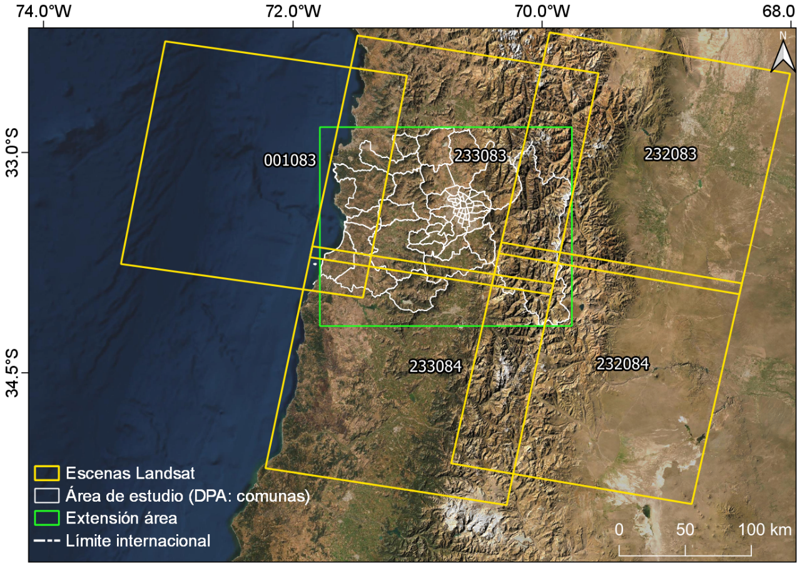
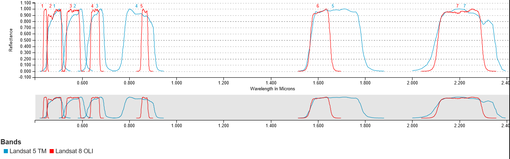
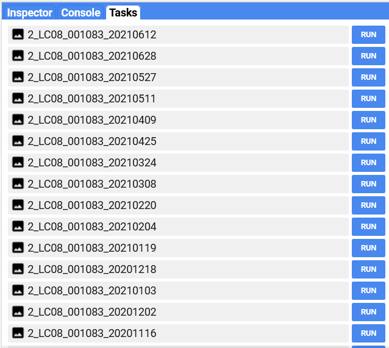
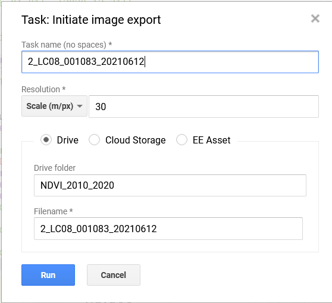
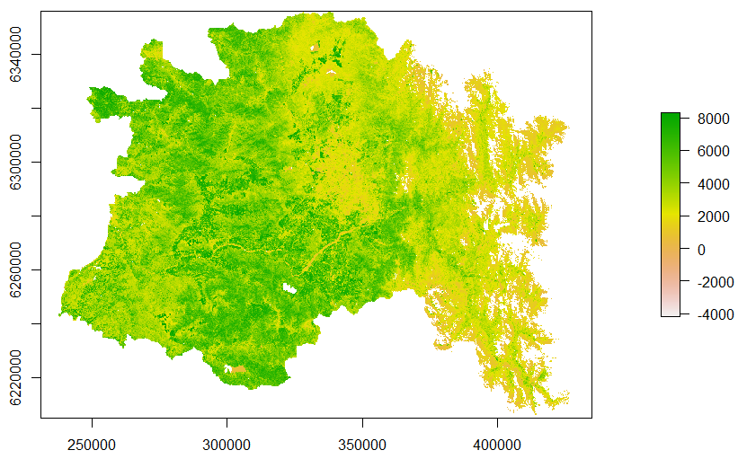
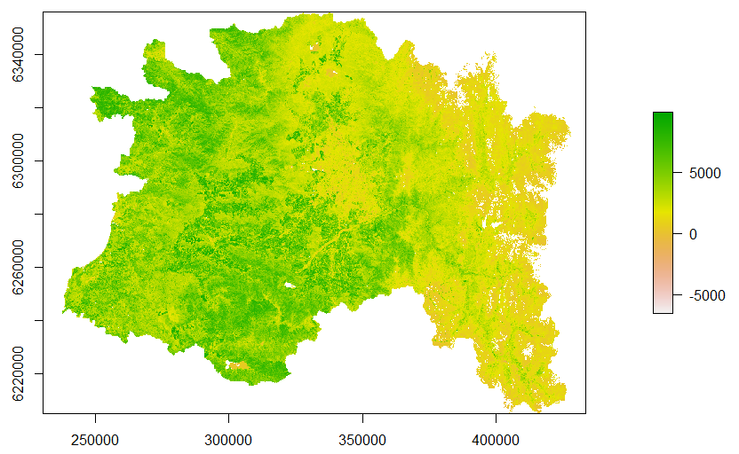

```{r setup, include=FALSE}
options(htmltools.dir.version = FALSE)
knitr::opts_chunk$set(echo = TRUE)
library(DT)
library(magrittr)
```

<style>
body {
text-align: justify}
details:hover { cursor: pointer }
</style>

<center>

</center>

# Introducción

El proceso de preparación de datos Landsat se realizó empleando el Code Editor de [Google Earth Engine](https://earthengine.google.com/). Se consideraron los datos de la Colección 1 Tier 1 para Landsat 5 TM  y Landsat 8 OLI de 5 path/row. 

<center></center>
<center>Path y rows landsat considerados en este trabajo</center>

El proceso de preparación para la reconstrucción fenológica fue realizado en ambiente ocal empleando R 4.0.2, para asegurar consistencia con la información disponible para el área GEF.

## 1.- Procesamiento en GEE

El orden del script en la consola de GEE será estructurado de la siguiente manera:

- Funciones de cálculo (renombre de bandas, armonización, cálculo de NDVI)
- Carga de colecciónes de imágenes y aplicación de funciones
- Descarga de datos.

### 1.1.1.- Renombrado de bandas y aplicación de QA.

El primer bloque de código, contempla renombrar las bandas espectrales para poner nombres comunes a los dos sensores (TM y OLI) con el fin de poder aplicar más fácilmente las funciones.

```{js eval=F}
//Preprocesamiento Landsat GEF Montaña
///////////////////////////////////////////////////////////////////////////////
// Renombrar bandas espectrales
// OLI
var renameOli = function (img) {
  return img.select(
      ['B2', 'B3', 'B4', 'B5', 'B6', 'B7', 'pixel_qa'],
      ['azul', 'verde', 'rojo', 'nir', 'swir1', 'swir2', 'pixel_qa']);
};

// TM y ETM
var renameEtm = function (img) {
  return img.select(
      ['B1', 'B2', 'B3', 'B4', 'B5', 'B7', 'pixel_qa'],
      ['azul', 'verde', 'rojo', 'nir', 'swir1', 'swir2', 'pixel_qa']);
};
```

Para trabajar con los pixeles que dispongan de información útil para los análisis, se considera solo el uso de los pixeles clasificados como **clear terrain** según el manual de los productos Landsat de L2 y su banda QA (Landsat Product Guide Colección 1 Level 2 [Landsat 8](https://prd-wret.s3.us-west-2.amazonaws.com/assets/palladium/production/atoms/files/LSDS-1368_L8_C1-LandSurfaceReflectanceCode-LASRC_ProductGuide-v3.pdf) y [Landsat 5](https://prd-wret.s3.us-west-2.amazonaws.com/assets/palladium/production/atoms/files/LSDS-1368_L8_C1-LandSurfaceReflectanceCode-LASRC_ProductGuide-v3.pdf)). Este criterio es estricto y puede ser reevaluado según la disponibilidad de información o el área de interés a trabajar, siguiendo los criterios de los manuales de usuario.

```{js eval=F}
// Aplicación QA
//Landsat 8
var l8Clouds = function (img){//indica que la función se realizará sobre una imagen
    // crea una nueva imagen desde la banda pixel_qa de cada archivo en la colección
  var pixel_qa = img.select('pixel_qa');
  var cl1 = pixel_qa.eq(322);
  var cl2 = pixel_qa.eq(386);
  var cl3 = pixel_qa.eq(834);
  var cl4 = pixel_qa.eq(898);
  var cl5 = pixel_qa.eq(1346);
  var mask = cl1.or(cl2).or(cl3).or(cl4).or(cl5);
  //actualiza información que se mantendrá en el dato de salida por pixel
  return img.updateMask(mask); 
};

//Landsat 5
var l5Clouds = function (img){//indica que la función se realizará sobre una imagen
  // crea una nueva imagen desde la banda pixel_qa de cada archivo en la colección
  var pixel_qa = img.select('pixel_qa');
  var cl1 = pixel_qa.eq(66);
  var cl2 = pixel_qa.eq(130);
  var mask = cl1.or(cl2);
  //actualiza información que se mantendrá en el dato de salida por pixel
  return img.updateMask(mask);  
};
```

### 1.1.2.- Armonización de sensores

Para el cálculo del NDVI y el uso entre los sensores TM y OLI, se requiere una armonización de las bandas debido a las diferencias en el ancho espectral de cada una entre ambos sensores. Lo que sumado a más elementos como: distancia en el tiempo de cada registro, alteraciones antrópicas, variabilidad de los propios índices, etc.; hacen que la información requiera de ajustes para poder ser empleada con mayor nivel de certidumbre.

<center></center>
<center>Respuestas espectrales sensores TM y OLI. Fuente: [Spectral Viewer USGS](https://landsat.usgs.gov/spectral-characteristics-viewer)</center>

EN el caso de este trabajo se aplicó la armonización descrita por [Roy et al., 2016](https://openprairie.sdstate.edu/cgi/viewcontent.cgi?referer=https://scholar.google.com/&httpsredir=1&article=1035&context=gsce_pubs) operacionalizada directamente sobre Earth Engine considerando las bandas BLUE, GREEN, RED, NIR, SWIR 1 y SWIR 2.

```{js eval = F}
// Armonización de reflectancias
// Define coeficientes según Roy et al. (2016) 
var coefficients = {
  itcps: ee.Image.constant([0.0003, 0.0088, 0.0061, 0.0412, 0.0254, 0.0172]).multiply(10000),
  slopes: ee.Image.constant([0.8474, 0.8483, 0.9047, 0.8462, 0.8937, 0.9071])
};

//función para armonizar
var etmToOli = function (img) {
  return img.select(['azul', 'verde', 'rojo', 'nir', 'swir1', 'swir2']) // selección de bandas
  //aplicación de coeficientes
      .multiply(coefficients.slopes)
      .add(coefficients.itcps)
      .round()
      .toShort()
  //agrega banda qa para filtros de calidad finales.
      .addBands(img.select('pixel_qa'));
};
```


### 1.1.3.- Cálculo de NDVI

Este bloque solo contiene la función para el cálculo de NDVI sempleando las bandas RED y NIR, disponibles en ambos set de datos.

```{js eval= F}
//Función para calcular NDVI
var NDVI = function (img) {
 return img.normalizedDifference(['nir', 'rojo']).rename('NDVI');
};
```


### 1.1.4.- Compilación de funciones para aplicación.

Con todas las funciones necesarias ya generadas, ahora se crea una función que compila a las demás y es la que se aplicará sobre las colecciones de datos. Para cada sensor, se crea una función compilatoria individualizada para facilitar la replicación o actualización de funciones en caso de ser necesario.

```{js eval = F}
// compila funciones para preparación de datos OLI
var prepOli =function (img) {
  var orig = img; // guardar propiedades
  img = renameOli(img); //renombrar bandas
  img = l8Clouds(img); // filtros QA
  img = NDVI(img); // cálculo de índice
  return ee.Image(img.copyProperties(orig, orig.propertyNames())); //copiar propiedades
};

// compila funciones para preparación de datos ETM+ y TM.
var prepEtm = function(img) {
  var orig = img; // guardar propiedades
  img = renameEtm(img); //renombrar bandas
  img = l5Clouds(img); // filtros QA
  img = etmToOli(img); // armonización
  img = NDVI(img); // cálculo de índice
  return ee.Image(img.copyProperties(orig, orig.propertyNames()));//copiar propiedades
};
```


### 1.1.5.- Importar colecciones y aplicación de funciones sobre imágenes.

En la consola de GEE, debe importar las colecciones de datos necesarias para trabajar, en este caso coleccion 1 Tier 1 Nivel 2. **Importante:** La colección 1 será procesada por todas las plataformas del USGS y GEE hasta el 31 de diciembre de 2021; luego de eso los procesos deben ser migrados a la colección dos.

Al importar las colecciones al script, aplique un filtro para seleccionar solo la temporalidad deseada de acuerdo a la información que busque descargar, agregue también una geometría que indique la región de interés para llamar a las imágenes de esa área en particular.

```{js eval = F}
///////////////////////////////////////////////////////////////////////////////////
// Importando colecciones

//Landsat 8
var L8sr = ee.ImageCollection("LANDSAT/LC08/C01/T1_SR") // colección
.filterBounds(geometry) // filtrar por geometría
.filterDate('2010-07-01', '2020-06-30') // rango temporal
.map(prepOli); // aplica funciones

// Landsat 5
var L5sr = ee.ImageCollection('LANDSAT/LT05/C01/T1_SR') // colección
.filterBounds(geometry) // filtrar por geometría
.filterDate('2010-07-01', '2020-06-30') // rango temporal
.map(prepEtm); // aplica funciones

//fusión de colecciones 
var full = L5sr.merge(L8sr) // fusiona colecciones 
.sort('system:time_start'); // ordena temporalmente las imágenes

```

### 1.1.6.- Descarga de datos.


Al procesar la información dentro de GEE, podemos optimizar el uso de espacio y descargar solo los resultados o solo la imagen acotada a una zona de nuestro interés. Para exportar podemos hacerlo a un asset (dentro de la memoria de GEE), a Google Cloud o a Google Drive. En el caso de Google Cloud debemos considerar pago por uso de almacenamiento, mientras que en Google Drive y assets estamos limitados al espacio de cada plataforma.

Existen diferentes formas de dar descarga a los datos, siempre desde el server side de GEE y considerando un número máximo de pixeles a descargar por tile. El ejercicio de descarga se realiza a partir de **tasks** que deben ser correctamente creados en el editor de código. Para generar el task de descarga, primero filtre la colección completa seleccionando su geometría, la banda de interés (NDVI) y los path y row de interés.

```{js eval = F}
//filtrado
var filterColl = full
.filterBounds(geometry)
.select(['NDVI'])
.filter(ee.Filter.or(
    ee.Filter.and(ee.Filter.eq('WRS_PATH', 1),         
                  ee.Filter.eq('WRS_ROW', 83)),
    ee.Filter.and(ee.Filter.eq('WRS_PATH', 233), 
                  ee.Filter.eq('WRS_ROW', 83)),
    ee.Filter.and(ee.Filter.eq('WRS_PATH', 233), 
                  ee.Filter.eq('WRS_ROW', 84)),
    ee.Filter.and(ee.Filter.eq('WRS_PATH', 232), 
                  ee.Filter.eq('WRS_ROW', 83)),
    ee.Filter.and(ee.Filter.eq('WRS_PATH', 1), 
                  ee.Filter.eq('WRS_ROW', 73))              
                  ));
```

Es importante destacar que la generación de varios task simultáneos puede tener efectos adversos sobre su explorador, por lo que se recomienda generar un número de task no tan grandes empleando filtros sobre la información que se quiera exportar. Un ejemplo, es el que se muestra a continuación y considera solo el path 001 y row 083 considerando datos desde el 1 de Julio de 2020 hasta el 30 de Junio de 2021.

```{js eval= F}
//filtrado
var filterColl = full
.filterBounds(geometry)
.select(['NDVI'])
.filterDate('2020-07-01', '2021-06-30')
  .filter(ee.Filter.or(
    ee.Filter.and(ee.Filter.eq('WRS_PATH', 1),         
                 ee.Filter.eq('WRS_ROW', 83)),
    //ee.Filter.and(ee.Filter.eq('WRS_PATH', 233), 
    //              ee.Filter.eq('WRS_ROW', 83))//,
    //ee.Filter.and(ee.Filter.eq('WRS_PATH', 233), 
    //              ee.Filter.eq('WRS_ROW', 84))//,
    //ee.Filter.and(ee.Filter.eq('WRS_PATH', 232), 
    //              ee.Filter.eq('WRS_ROW', 83))//,
    //ee.Filter.and(ee.Filter.eq('WRS_PATH', 1), 
    //              ee.Filter.eq('WRS_ROW', 73))              
                  ));
```

Considerando que los task se generan de forma individualizada (1 a la vez), se puede generar un ciclo for (no recomendado) para crear los task. En este ejercicio se emplea **[geetools](https://github.com/fitoprincipe/geetools-code-editor/wiki)**, desarrollado por [Rodrigo E. Principe](https://github.com/fitoprincipe) y proporcionan un set adicional de herramientas que extienden las posibilidades base del code editor.

A continuación veremos como generar todas las tareas para la colección filtrada.

```{js eval=F}

// Batch export
var batch = require('users/fitoprincipe/geetools:batch'); // carga de herramientas
batch.Download.ImageCollection.toDrive(filterColl, // creación de los task
                                      "NDVI_2020_2021", { // carpeta
                                                            scale:30, // tamaño del pixel
                                                            crs:'EPSG:32719', // CRS de salida
                                                            region:geometry // área de exportación
                                                            });
```

Una vez ejecutado el código, puede revisar la pestaña de task y verá las tareas creadas para la descarga de cada NDVI disponible para ese path/row dentro del periodo seleccionado. Para iniciar cada task debe oprimir el botón **Run** que abrirá un cuadro con las opciones del task correspondiente, una vez confirmado el task se comenzará a ejecutar.

<center></center>
<center></center>

## 2.- Procesamiento en R

Una vez descargada la información de interés, correspondiente al NDVI, es necesario crear nombres adecuados y configurar una tabla de fechas que permita mantener la información ordenada para los procesos que vienen. En este caso, se empleará el límite político administrativo dle área GEF (DPA) para cortar y enmascarar las escenas asegurando la misma extensión de todos los archivos.


### 2.1.- Preparación de datos y creación de tablas de fechas

A continuación, configure de la siguiente forma:

```{R eval = F}
#preparación de daots NDVI Landsat 
#-------------------------------------
#librerías
library(tidyverse)
library(lubridate)
library(sf)
library(parallel)
library(doParallel)
library(raster)
#-------------------------------------
```

Ahora, se deben crear dos listas una que contenga la ruta completa a los archivos y otra que solo contenga los nombres. Adicionalmente, debe cargar la capa vecttorial del DPA de nombre **DPA_join.gpkg** que es la capa que se empleará para ajustar las imágenes al área de estudio.

```{r eval=F}
#input data
#Raster
# Lista con la ruta completa a los archivos descargados
landsat.files <- list.files(path = 'directorio/NDVI_GEF_2000_2010/', 
                            pattern = glob2rx('*.tif'),full.names = T)
#lista de nombres de los archivos descargados
landsat.names <- list.files(path = '03_landsat/NDVI_GEF_2000_2010/',
                            pattern = glob2rx('*.tif'))
#vector
shp <- st_read('shp/DPA_join.gpkg') %>% st_transform(32719)
```

Con las listas de archivos ya cargadas en el entorno de trabajo, hay que configurar la creación de los nombres nuevos de los archivos considerando:

- ID de la escena correspondiente al sensor
- Información del path y row
- Fecha de la imagen

```{r eval = F}
## creación de nombres nuevos
#extracción de id del sensor
ID <- str_extract(landsat.names,pattern = '[A-Z]+[0-9]+')

#extracción de path y row
sceneInfo <- str_extract(landsat.names,pattern = '_[0-9]+_[0-9]+') %>% substr(1,7) #considere que valores 1 y 7 pueden cambiar según la extensón de su línea


fechas <- str_extract(landsat.names,pattern = '_[0-9]+_[0-9]+') %>% substr(9,20) %>% as.Date(format='%Y%m%d') #considere que valores 9 y 20 pueden cambiar según la extensón de su línea

#creación de objeto con nombres de las imágenes
new.names <- paste('directorio/03a_NDVI_2000_2010/',
                   fechas,'_',ID,sceneInfo,'.tif',sep='')

# ejemplo de resultado
#"directorio/03a_NDVI_2000_2010/2003-08-30_LT05_001083.tif"
```

Esta configuración de nombre `2003-08-30_LT05_001083.tif` permite que las imágenes se ordenen cronológicamente dentro de la carpeta de forma inmediata.

Ahora hay que generar una tabla que permita registrar la información de las imágenes descargadas, las fechas, sensor, entre otros datos relevantes para mantener un control estricto de la información.

```{r eval = F}
## Creación de tabla con información de escenas trabajadas

df.landsat <- cbind.data.frame(ID,sceneInfo,fechas, landsat.names) #combinar 
df.landsat <- df.landsat[order(df.landsat$fechas),] %>% #ordena cronológicamente la tabla
  mutate(N_order = c(1:length(ID)))#agrega columna orden correlativo

#guarda tabla en el disco
write.csv(df.landsat,file = 'directorio/landsat_dates_2000-2010.csv')
```

```{r echo=F, error=F, message=FALSE, warning=FALSE,out.width='100%'}
library(tidyverse)
read_csv('example_table_Landsat.csv') %>% 
    datatable(class = 'cell-border stripe',extensions = 'FixedColumns',rownames = FALSE,
            options = list(pageLength = 5,dom = 't', scrollX = TRUE,fixedColumns = TRUE))
```

Con todos los inputs ya generados, ahora solo queda estructurar el ciclo que permitira aplicar el proceso de corte, enmascarado y guardado en disco de los archivos. Para optimizar este proceso, se propone realizar el trabajo empleando funciones multinúcleo según el número de núcleos del procesador, para esto el ciclo debe ser estructurado de la siguiente forma.

```{r eval=F}
## preparación de núcleos
nCluster <- detectCores()-1 #siempre dejar un núcleo libre
cl <- makeCluster(nCluster) #crear cluster de procesamiento
registerDoParallel(cl) #registrar cluster

#ciclo de procesamiento en paralelo
foreach (i= 1:length(new.names)) %dopar% {
  #incoporar librerías necesarias
  library(raster)
  library(magrittr)
  
  r <- landsat.files[i] %>% raster() %>% crop(shp) %>% mask(shp) #corte y enmascarado
  
  r1 <- r*10000 #reescalar datos
  
  #guardado en el disco
  writeRaster(r1,filename = new.names[i],
              format='GTiff',datatype='INT2S', overwrite=T)
  
  if (file.exists(landsat.files[i])) { #borra imagen original descargada del disco
    #borra archivo
    file.remove(landsat.files[i])
    rm(r) #borra stack de la memoria para liberar memoria RAM
  }
}

stopCluster(cl) # detiene el cluster
```


### 2.2.- Fusión de escenas

Considerando que tenemos diversdas áreas con traslape de información para la misma fecha, como por ejemplo path 233/083 y 233/084 y en general para todas las escenas rows continuos en el mismo path. Esto puede generar un exceso de áreas sin datos y dificultar la reconstrucción fenológica generando artefactos en la información.

Para fusionar los datos, se debe emplear la lista de archivos cortados en el proceso anterior y la tabla de fechas generada para controlar la información indexada.

Configure su script inicial.

```{r eval=F}
#Fusión de escenas de la misma fecha
#-----------------------------------------
#librerías
library(tidyverse)
library(lubridate)
library(raster)
library(sf)
library(SpaDES.tools)
#-----------------------------------------
#raster data
## Raster data
landsat.1 <- list.files(path = 'directorio/03a_NDVI_2000_2010/',
                        pattern = glob2rx('*.tif'),full.names = T)
## tabla de fechas
table.dates <- read_csv('directorio/landsat_dates_2000-2010.csv')
all.dates <- table.dates$fechas #objeto tipo fechas
```

Con los datos ya cargados ahora hay que crear un archivo que contenga las fechas únicas para poder ejecutar el ciclo de filtro y fusión de los datos.

```{r eval=F}
##fechas únicas
uni_dates <- all.dates %>% unique()
```

Ahora para poder fusionar se debe considerar que existen escenas que no replican fechas y otras que si lo hacen, por lo cual, el ciclo de procesamiento debe incluir algunas condiciones como se muestra en el siguiente bloque de código.

```{r eval=F}
# ciclo de merge de imágenes

for (i in 1:length(uni_dates)){#considera el número de fechas únicas
  select_date <- uni_dates[i] #guarda fecha seleccionada
  dates_comp <- table.dates %>%
    filter(fechas == select_date) #crea objeto con imágenes en esa fecha

  #condicional 1-> si solo hay un registro en esa fecha
if(nrow(dates_comp)==1){
  r <- landsat.1[dates_comp$N_order] %>% raster() #crea la capa raster
  n1 <- names(r) %>% gsub(pattern = '*X',replacement = '') %>% 
    gsub(pattern = '\\.',replacement = '-') #extrae fecha, ID sensor, path y row de imagen
  
  #guarda en disco
  writeRaster(r,filename = paste('directorio/NDVI_20102020/NDVI_',n1,'.tif',sep=''),
              datatype='INT2S',overwrite=T)
  rm(r) #borra archivo de la memoria virtual
}
  #condicional 2 -> si hay dos registros en la misma fecha
if(nrow(dates_comp)>1){
  r1 <- landsat.1[dates_comp$N_order[1]] %>% raster()#crea primer raster
  r2 <- landsat.1[dates_comp$N_order[2]] %>% raster() #crea segundo raster
  lista <- list(r1,r2) #arma lista de los rasters para el merge
  
  mr <- mergeRaster(lista, fun = mean) #arma mosaico empleando el promedio simple
  
  n1 <- paste(select_date,'_',dates_comp$ID[1],dates_comp$sceneInfo[1],
              dates_comp$sceneInfo[2],'.tif',sep='') #crea nombre con fecha, ID sensor, path y row de imagen
  
  #guarda mosaico en el disco
  writeRaster(mr,filename = paste('directorio/NDVI_20102020/NDVI_',n1,sep=''),
              datatype='INT2S',overwrite=T)
  rm(mr)#borra archivo de la memoria virtual
}
  
  paste('date:',i,'-',select_date, 'ready!') %>% print()
}
```

La demora de este proceso dependerá del número de escenas a procesar.


## 3.- Cálculo de fenología empleando **[npphen](https://CRAN.R-project.org/package=npphen)**

Al igual que para el trabajo con datos MODIS, para la reconstrucción fenológica Landsat se necesita tener la información en formato raster y una tabla con las fechas de cada una de las imágenes a emplear. Para el período 2000-2010 se dispone de la tabla **landsat_dates_2000-2010_ts950.csv** que contiene la información requerida para los archivos TIF del mismo periodo.

### 3.1.- Reconstrucción fenológica

Primero, configure su script para el trabajo de reconstrucción fenológica con Landsat con las librerías necesarias y genere una lista con los archivos NDVI. Además cargue la capa vectorial de nombre **grid_10k.gpkg**, que contiene cuadrantes de 10x10 km con el fin de ejecutar el proceso de reconstrucción fenológica por sectores considerando la demanda de recursos computacionales del proceso.

Debido a que la resolución de los productos es mayor, el número de datos también lo es, por lo que las ventanas de procesamiento son menores para no sobrecargar la memoria virtual ni el disco de almacenamiento de la unidad donde se desarrolle el procesamiento.

```{r eval = F}
# Reconstrucción fenológica Landsat 2000-2010
#---------------------------------------------
#libraries
library(tidyverse)
library(lubridate)
library(raster)
library(sf)
library(npphen)
#-------------------------------------------
## Raster data
landsat.files <- list.files(path = 'directorio/03a_NDVI_2000_2010/',pattern = glob2rx('*.tif'),full.names = T)
st <- landsat.files %>% stack() #creando rasterStack

## vector data
grid_shp <- st_read('directorio/grid_10k.gpkg') #carga de grilla para procesamiento
n.cuad <- grid_shp$id #extracción de cuadrantes

## tabla de fechas
table.dates <- read_csv('directorio/landsat_dates_2000-2010_ts950.csv') 
all.dates <- table.dates$fechas %>% as.character() %>% 
  gsub(pattern = '*-12-31',replacement = '-12-30') %>% as.Date() #crea objeto de fechas y reemplaza para evitar problemas con años bisciestos
```

Considerando que los datos Landsat no tienen una frecuencia temporal tan regular como en el caso de MODIS, la función de reconstrucción fenológica fue adaptada para esta condición irregular. La función para Landsat, de nombre **LanPhenMap_gef_365.R** considera la misma parametrización, pero entrega la fenología con 365 bandas (días) a diferencia de MODIS que considera 23 bandas (1 imagen cada 16 días). Primero debe cargar la función y generar los nombres de salida para las fenologías que saldrán por cada uno de los cuadrantes.

```{r eval = F}
## nombres de salida
outpath <- 'directorio/landsat_phenology/' #directorio para guardar
nombres <- paste(outpath,'subset_0',n.cuad,'.tif',sep='') # nombres de salida de los archivos

## Carga de función para reconstrucción fenológica
source('RFUN/LanPhenMap_gef_365.R')
```

Con esto cargado, se puede iniciar el loop para el cálculo de la fenologíaa con los datos Landsat.

```{r eval=F}
#----------------------------------------------------
#ciclo de reconsrucción fenológica por cuadrantes

library(ks)

for (i in 1:length(n.cuad)) {# considera duración según número de cuadrantes
  
  shp_filter <- grid_shp %>% filter(id == i) #filtro de cuadrante
  
  ss <- st %>% crop(shp_filter) %>% mask(shp_filter) #corte y enmascarado del rasterStack
  
  #función de reconstrucción fenológica
  LanPhenMap(s = ss,dates = all.dates,h = 2,nGS = 365, nCluster = 7,format = 'GTiff',
             datatype = 'INT2S',rge = c(0,10000),outname = nombres[i])
  rm(ss)#borra objeto de la memoria virtual
  
  cat(paste('Cuadrante',i,'ready'),sep='\n')
}
#------------------------------------------------------
```

Este proceso consume bastante tiempo y recursos de procesamiento, por lo que se recomienda dedicar un computador o servidor exlusivo considerando tiempos de procesamiento altos (~ + de 1 semana). Una vez calculados todos los cuadrantes, el procedimiento de mosaico es idéntico al de MODIS considerando la creación de una lista de los cadrantes y el proceso posterior de fusión.

```{r eval=F}
#-----------------------------------------------------------------
# Creación de mosaicos
# Lista de cuadrantes y directorio con fenología
grid.list <- list.files(path='directorio/landsat_phenology/',pattern = glob2rx("*subset*.tif"), full.names=T)

#lista para los cadrantes
lista <- vector(mode="list", length(grid.list))

#Ciclo para cargar bricks en la lista
for (i in 1:length(grid.list)) {
  lista[[i]] <- brick(grid.list[i])
}

x <- lista
x$overwrite <- TRUE
m <- do.call(merge, x) #mosaico de cuadrantes

#guardado en disco
writeRaster(m,filename = "directorio/landsat_phenology/Landsat_Phen2000_2010_merged.tif",
            format = "GTiff", overwrite = T, datatype = 'INT2S')
```


### 3.2.- Cálculo de anomalías de NDVI

Con la información fenológica del período base para Landsat, se pueden obtener también las anomalías comparando algunas fechas con la fenología de la misma forma que con MODIS. El cálculo de anomalías en el caso de Landsat se recomienda a nivel mensual, para poder obtener al menos un promedio mensual de toda el área considerando que cada fecha puede corresponder solo a una parte del área GEF.

A continuación, configure inicialmente el script para el cálculo de anomalías considerando: la tabla de fechas del período que quiere calcular (2010 - 2020), la fenología del período base y la tabla de nombre **DGS_month_landsatPhenology.csv** que contiene el identificador del mes para cada banda de la fenología.

```{r eval=F}
##Cálculo de anomalías Landsat
#---------------------------------------------------------------
#librerías
library(tidyverse)
library(raster)
library(lubridate)
#-----------------------------------------------------------------
#input data
# Tabla de fechas
dates.table <- read_csv('tables/landsat_dates_2010-2020_ts1088.csv') #tabla de fechas periodo 2010-2020
all.dates <- dates.table$fechas #objeto de fechas
dates.table$meses <- all.dates %>% month() #crea campo con los meses
dates.table$anno <- all.dates %>% year() #crea campo con los años

# raster data

phen <- stack('directorio/landsat_phenology/Landsat_Phen2000_2010_merged.tif') #fenología período base
dgs <- read_delim('directorio/DGS_month_landsatPhenology.csv',delim = ';') # tabla con indicador de mes

#NDVI
ndvi <-list.files(path = 'directorio/03b_NDVI_2010_2020/',
                  pattern = glob2rx('*.tif'),full.names = T)
ndvi.st <- stack(ndvi)
```

Con esta información en el entorno de trabajo disponible, es necesario generar un promedio mensual de de la fenología para el mes de interés. En este caso, considere el mes de enero para poder obtener el promedio mensual para el cálculo de anomalías.

```{r eval=F}
#-----------------------------------------------------------
#promedio mensual para fenología enero

# filtrar mes empleando la tabla
mes <- dgs %>% filter(month == 'ene')
# extraer bandas correspondientes al mes
phen.sub <- phen[[mes$DGS]]
 
phen.month <- phen.sub %>% mean(na.rm=T) #promedio mensual
names(phen.month) <- 'Enero' #asignar nombre a la banda

```

<center></center>

La imagen puede guardarse en el disco, si se quiere para mantener una base de datos ordenada y hacer más operativo el cálculo de las anomalías.

Ahora, hay que seleccionar los NDVI del mes al cual se le quiere calcular la anomalía para obtener el promedio mensual. La mecánica de selección es similar a lo descrito para la selección del mes en la fenología, pero considerando el uso de la tabla de fechas y el indexador disponible en la misma tabla. En este ejemplo, haga uso del mes de enero de 2015:

```{r eval=F}

# Selección de datos de NDVI de enero de 2015
bandas <- dates.table %>% filter(anno == 2015 & meses == 1)# filtro de datos
fecha <- bandas$fechas #extracción de fechas
n <- bandas$X1 #indice de bandas

#subset de bandas del mes y año seleccionado
img <- ndvi.st[[n]]
img.mean <- img %>% mean(na.rm=T) #promedio mensual enero 2015
```

<center></center>

Ahora, puede calcular la anomalía considerando la resta simple de la imagen con la fenología del mes correspondiente.

```{r eval=F}
#anomalía
anom <- img.mean - phen.month

#grafico simple
library(rasterVis) 
library(sf)

#leer capa
capa <- read_sf('shp/GEF_Area_diss.shp') %>% st_transform(32719)
gef <- capa %>% st_geometry %>% as(Class="Spatial")

#gráfico básico
levelplot(anom, par.settings = RdBuTheme ,
          at=seq(-2500, 2500, 100), margin = F, 
          maxpixels = 10e6) + 
  latticeExtra::layer(sp.lines(gef, col="gray30", lwd=0.5))
```

<center></center>
