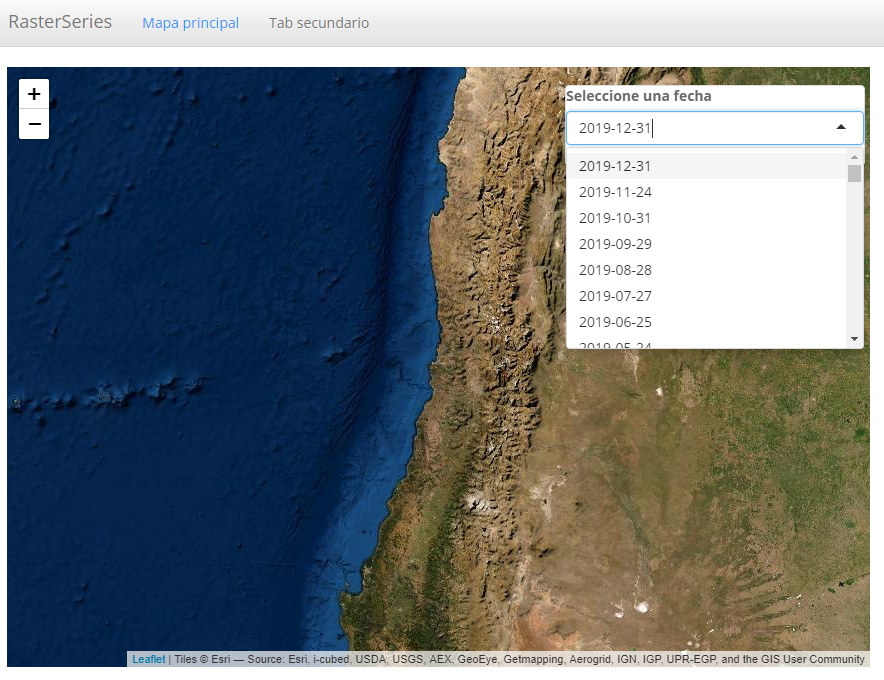

background-image: url(logo_labgrs_color.png)
background-position: center
background-size:40%

```{r setup, include=FALSE}
options(htmltools.dir.version = FALSE)
library(shiny)
library(leaflet)
library(tidyverse)
library(sf)
library(raster)
library(dygraphs)
library(shinythemes)
```


---

Librerías utilizadas en esta sesión

```{r eval=F}
library(shiny)
library(leaflet)
library(tidyverse)
library(sf)
library(raster)
library(dygraphs)
library(shinythemes)
```


---
class: inverse, center, middle

# INTRODUCCIÓN

---
# Summary

--
- Hasta el momento hemos visto como estructurar aplicaciones

--
- Hemos creado y empleado funciones

--
- Hemos empleado widgets y elementos reactivos

--
- Hemos visto algunas configuraciones de páginas


---
#Metas de hoy

--
- Hoy realizaremos una nueva aplicación donde usaremos reacciones de mapa sobre elementos raster (SST mensual MODIS Aqua, 4 km.)

--
- Además veremos como insertar imágenes (útil para logos)

--
- Veremos como graficar series de tiempo

--
.center[

]
.center[.footnote[© Allison Horst]]

---
#UI

--
- Configuraremos un tipo de app con pestañas.

--
```{r eval=F}
ui <- navbarPage(title = 'RasterSeries',id = 'nav',theme = shinytheme("spacelab"), # App theme 
                 tabPanel('Mapa principal', # Main page view
                          leafletOutput("map", width = "100%", height = 600), # Main map
                          # Option panel
                          absolutePanel(id = "controls", class = "panel panel-default", fixed = F,
                                        draggable = F, top = 90, left = "auto", right = 20, bottom = "auto",
                                        width = 300, height ="auto",
                                        style="z-index:500;"),
                          absolutePanel(top = 85,left = 80,right = 'auto',width = 200,
                                        height = 200,bottom = 'auto',fixed = T,style="z-index:500")
                 ),
                 #Description
                 tabPanel('Tab secundario',
                          sidebarLayout(sidebarPanel(),
                            mainPanel())
                          )
)
```

---
#Server

--
- Nuestro server deberá de momento estar vacío.

--
```{r eval=F}
server <- function(input, output, session) {
  
}

shinyApp(ui, server)
```

---
# ¿Qué queremos en nuestras pestañas?

--
- Esta sesión nos enfocaremos en la primera

--
- Un mapa dinámico

--
- Visualización de rasters con opción de seleccionar la fecha del registro

--
- Serie de tiempo a través de un click


---
#Agregando opciones

--
- Agregaremos un *uiOutput()* en el primer panel absoluto para la selección de fechas

--
```{r eval=F}
# Option panel
absolutePanel(id = "controls", class = "panel panel-default", fixed = F,
              draggable = F, top = 90, left = "auto", right = 20, bottom = "auto",
              width = 300, height ="auto",
              style="z-index:500;",
              uiOutput('fechasInput'))
```

--
- Crearemos en el server nuestro mapa base y cargaremos la información de las fechas

--
```{r eval= F}
#fechas
  dates.table <- read_csv('data/tables/allDates_sst.csv') 
  dates <- dates.table$x

#Render UI
output$fechasInput <- renderUI({
    selectInput(inputId = 'fechas',label = 'Seleccione una fecha',
                choices = rev(dates),selected = tail(dates,1))
  })
#basemap
  output$map <- renderLeaflet({
    leaflet() %>% addProviderTiles(providers$Esri.WorldImagery) %>% 
      setView(lng = -71.5, lat = -33.12,zoom = 6)
  })
```

---
class: center, middle


---
#Insertando una imagen (logo)

--
- Para que shiny reconozca las imágenes que deseamos emplear, crearemos una carpeta de nombre *www* en el directorio de la aplicación.

--
- Ahí pegaremos pegaremos la imagen de nombre *logo_labgrs.png*

--
- Para agregar imágenes podemos emplear la función *img()*. La pondremos en el segundo panel absoluto

--
```{r eval=F}
absolutePanel(top = 85,left = 80,right = 'auto',width = 200,
              height = 200,bottom = 'auto',fixed = T,style="z-index:500",
              img(src='logo_labgrs.png',width=250,height=100)
             )
```

---
class: center, middle


---
#Otra alternativa

--
- Uso de HTML

--
```{r eval=F}
 absolutePanel(top = 85,left = 80,right = 'auto',width = 200,
               height = 200,bottom = 'auto',fixed = T,style="z-index:500",
               HTML('')
               )
```

---
class: middle, center


--
- *Tip*: para lograr que una imagen sea responsive (adaptativa) pueden agregar en el código HTML `class="img-responsive"`

---
#Ahora cargaremos los datos en nuestro server

--
- Para esto utilizaremos una lista de nuestros archivos en el server

--
```{r eval=F}
#raster data
  sst.list <- list.files(path = 'data/monthly_sst/',pattern = glob2rx('*sst*.tif'),full.names = T)
```

--
- Esto no llamará los rasters, pero hará que estén disponibles de manera indexada en nuestro sistema.

---
#Proxy para raster

--
- Ahora configuraremos primero la carga dinámica de los datos de sst.

--
```{r eval=F}
#proxy raster plot
  observeEvent(input$fechas,{
    #select file
    n <- which(dates==input$fechas)
    #colorramp
    colores <- c('#a50026','#d73027','#f46d43','#fdae61','#fee090',
                 '#ffffbf','#e0f3f8','#abd9e9','#74add1','#4575b4','#313695')
    pal <- colorNumeric(rev(colores), seq(10,25,1), na.color = "transparent")
    #raster file
    r <- sst.list[n] %>% raster()
    #add to map
    leafletProxy('map') %>% clearControls() %>% clearImages() %>% 
      addRasterImage(r,group = 'SST°C',method = 'ngb', colors = pal)
  })
```

---
class: middle, center

---
#Reactive click

--
- Para poder emplear la reacción de mapa crearemos una expresión reactiva que almacene la información del punto clickeado.

--
```{r eval=F}
  xy.map <- eventReactive(input$map_click,{
    click <- isolate({input$map_click})
    clat <- click$lat
    clng <- click$lng
    dts <- SpatialPoints(data.frame(clng,clat),
                         proj4string = CRS("+proj=longlat +datum=WGS84 +no_defs"))
    dts
  })
```

--
- El objeto *xy.map()* servirá para poder extraer las series de tiempo que queremos.

--
- Para facilitar la extracción de las series usaremos el archivo *pixels.RData* que dispone de cada valor de pixel, con su respeciva coordenada en formato data frame de nombre *tabla*.

--
```{r eval=F}
 #load pixels data
  load('data/tables/pixels.RData')
```

---
#Click markers

--
- Con las coordenadas reactivas, agregaremos marcadores que muestren a los usuarios y usuarias que punto marcaron en el mapa

--
- *Tip*: cada reacción que modifique el mapa (agregar markers, polígonos, rasters, cambio de colores, etc.), es recomendable ponerlo en un *observer distinto*

--
```{r eval=F}
 # click markers
  observeEvent(input$map_click,{
    click <- input$map_click
    clat <- click$lat
    clng <- click$lng
    leafletProxy("map")  %>% clearMarkers() %>% addMarkers(lng=click$lng, lat=click$lat, 
                                                           label= paste('lat:',clat,'lng',clng))
  })
```

---
class:middle, center

---
#Reactive time series

--
- Para facilitar la secuencia lógica, crearemos un elemento reactivo que almacene la información del pixel seleccionado.

--
- Emplearemos para esto las coordenadas *xy.map()* y la función *cellFromXY()*.

--
- Con estos datos extraeremos la información de la tabla para nuestra serie de tiempo

--
```{r eval=F}
#cargar una banda para seleccionar el número de pixel
d.select <- sst.list[1] %>% raster()
#Creando vector con la serie
r.cell <-  reactive({
  a1 <- cellFromXY(d.select,xy.map())
  c <- tabla[a1,3:ncol(tabla)] %>% as.numeric()
  return(c)
  })
```

---
#Mostrando series

--
- Para esto crearemos primero un objeto *ts* dentro de R mediante la función *ts()*

--
- Luego realizaremos el gráfico con la función *dygraph()* de la librería [dygraphs](https://rstudio.github.io/dygraphs/index.html)

--
```{r eval=F}
output$ts <- renderDygraph({
    ts.px <- ts(r.cell(),start = c(2003,1),end = c(2019,12),frequency = 12)
    #plot
    dygraph(ts.px) %>%
      dySeries("V1", label = "SST°C") %>%
      dyRangeSelector(height = 20, strokeColor = "") %>%
      dyAxis("y", label = "Temp (C)", valueRange = c(10, 25)) %>%
      dyOptions(drawPoints = TRUE, pointSize = 2,colors = 'black')
  })
```

--
- Siéntanse libres de manejar las opciones de visualización

---
class: middle, center

---
class: inverse,center, middle

# ¿PREGUNTAS?


---

class: inverse,center, middle

# PRÓXIMA SEMANA SEGUIMOS <br> MEJORANDO NUESTRA APP <br> 

