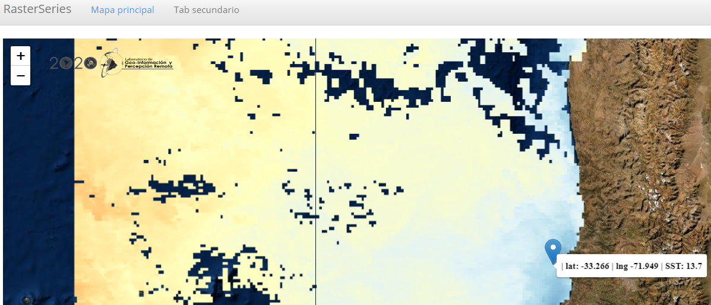

background-image: url(logo_labgrs_color.png)
background-position: center
background-size:40%

```{r setup, include=FALSE}
options(htmltools.dir.version = FALSE)
library(shiny)
library(leaflet)
library(tidyverse)
library(sf)
library(raster)
library(dygraphs)
library(shinythemes)
library(ggfortify)
```


---

Librerías utilizadas en esta sesión

```{r eval=F}
library(shiny)
library(leaflet)
library(tidyverse)
library(sf)
library(raster)
library(dygraphs)
library(shinythemes)
library(ggfortify)
```


---
class: inverse, center, middle

# INTRODUCCIÓN

---
# Summary

--
- Hasta el momento hemos visto como estructurar aplicaciones

--
- Hemos creado y empleado funciones

--
- Hemos empleado widgets y elementos reactivos

--
- Hemos visto algunas configuraciones de páginas

--
- La clase anterior vimos series de tiempo desde leaflet y shiny


---
#Metas de hoy

--
- Cerraremos con consultas de la clase anterior

--
- Nos enfocaremos en la segunda pestaña donde:
  + Crearemos una sección para subir archivos a nuestra aplicación
  + Porporcionaremos un análisis simple
  + Permitiremos la descarga de resultados.

--
.center[

]
.center[.footnote[© Allison Horst]]

---
Seguiremos empleando nuestra aplicación de la clase anterior

.center[]

---
# Mostrar valor del pixel seleccionado en el pop up

--
- Modificaremos solamente el **observer** que agrega los marcadores a nuestro mapa
--
```{r eval=F}
  # click markers
  observeEvent(input$map_click,{
    #extraer celda
    n.cell <- cellFromXY(d.select,xy.map())
    #Extraer columna
    n.col <- which(dates==input$fechas)
    #valor
    px.value <- tabla[n.cell,n.col] %>% as.numeric()
    #coordinates
    click <- input$map_click
    clat <- click$lat
    clng <- click$lng
    #ProxyMap
    leafletProxy("map")  %>% clearMarkers() %>% 
      addMarkers(lng=click$lng, lat=click$lat,label= paste('| lat:',round(clat,3),'| lng',
                                                           round(clng,3), '| SST:',round(px.value,2)),
                 labelOptions = labelOptions(style = list("color" = "black", "font-size" = "14px",
                                                          "font-family" = "serif",
                                                          "font-weight" = "bold")))
  })
```

---
class: middle, center


---
#Tab secundaria

--
- Agregando la opción de subir datos.
- Pondremos la función *fileInput()* para habilitar esto en nuestro *sidebarPanel()*

--
```{r eval=F}
fileInput('target_upload', 'Suba su tabla', accept = c('.csv'))
```

--
- Agregaremos la función *downloadButton()*

```{r eval=F}
downloadButton('descargar','Descargar plot')
```

-- 
- Nuestro segundo tabPanel quedaría así

--
```{r eval=F}
 tabPanel('Tab secundario',
                          sidebarLayout(sidebarPanel(
                            fileInput('target_upload', 'Suba su tabla', accept = c('.csv')),br(),
                            actionButton('plot',label = 'Plot'),
                            downloadButton('descargar','Descargar plot'),
                            fluid=T,width = 2),
                            mainPanel(plotOutput('decom'))
                          ))
```

---
# Generando la subida en el server

--
- En este ejemplo usaremos series de tiempo en formato **.csv*

--
```{r eval=F}
datos <- reactive({
    req(input$target_upload)
    inFile <- input$target_upload
    if (is.null(inFile))
      return(NULL)
    df <- read_csv(inFile$datapath)
    df_subset <- df[,'sst']
    return(df_subset)
  })
```

--
- Crearemos un elemento reactivo que contendrá el gráfico

--
```{r eval=F}
graf <- eventReactive(input$plot,{
    req(!is.null(datos()))
  
    ts.serie <- ts(datos(),start=c(1981,9),end=c(2020,4),frequency=365)
    g <- autoplot(ts.serie, ylab = 'SST °C',asp = 0.2)
    g
  })
```

---
#Renderizando el gráfico

--
```{r eval=F}
observeEvent(input$plot,{
    req(!is.null(datos()))
    output$decom <- renderPlot({
      graf()
    })
  })
```

--
.center[

]

---
# Configurando al descarga

--
```{r eval=F}
 ## habilitar descarga
  output$descargar <- downloadHandler(
    #nombre de archivo
    filename = "serie.jpg",
    content = function(file){
      ggsave(file, graf(),dpi = 150,width = 15,height = 10)
    }
  )
```

---
#Añadamos un pequeño proceso en los datos

--
- Para esto añadiremos la función *checkboxInput()*

--
- Nuestro tabPanel queda de la siguiente manera

--
```{r eval=F}
 tabPanel('Tab secundario',
                          sidebarLayout(sidebarPanel(
                            fileInput('target_upload', 'Suba su tabla',accept = c('.csv')),br(),
                            checkboxInput("desc", label = "Descomponer serie", value = F),br(),
                            actionButton('plot',label = 'Plot'),
                            downloadButton('descargar','Descargar plot'),
                            fluid=T,width = 2),
                            mainPanel(plotOutput('decom'))
                          ))
```

---
#En el server

--
- Cambiaremos el código que crea los gráficos

--
```{r eval = F}
 graf <- eventReactive(input$plot,{
    req(!is.null(datos()))
    ts.serie <- ts(datos(),start=c(1981,9),end=c(2020,4),frequency=365)
    
    if(input$desc == T){
      g <- decompose(ts.serie) %>% autoplot() 
    }
    if(input$desc == F){
    g <- autoplot(ts.serie, ylab = 'SST °C',asp = 0.2)}
    g
  })
```

---
class: middle, center


---
class: inverse,center, middle

# ¿PREGUNTAS?


---

class: inverse,center, middle

# PRÓXIMA SEMANA PRESENTACIÓN DOS <br>  <br> 

