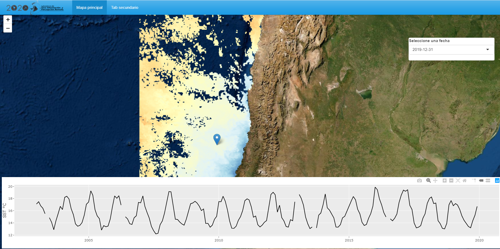
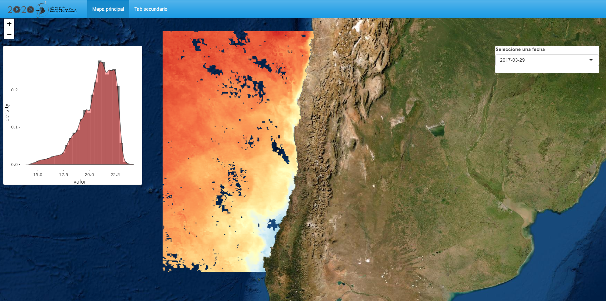
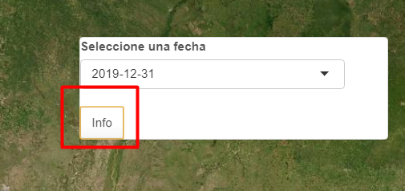
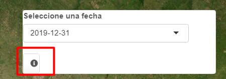
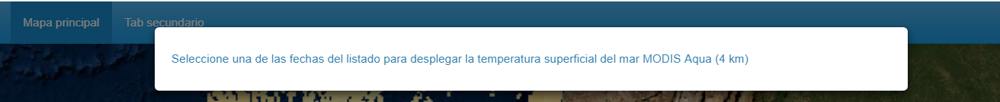
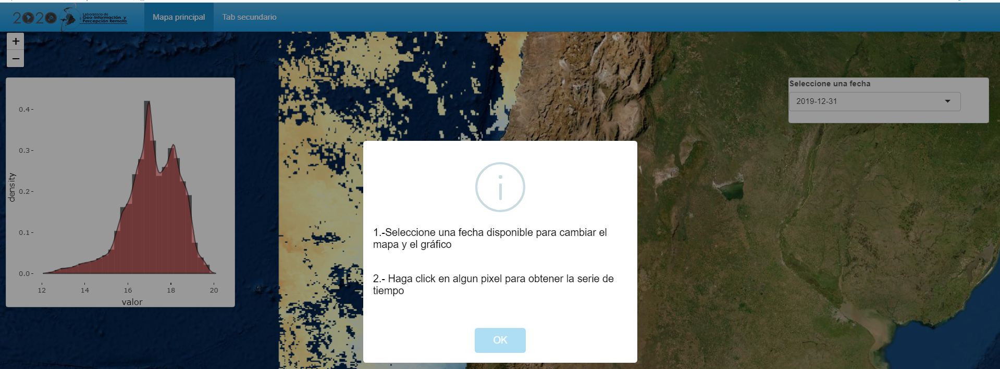
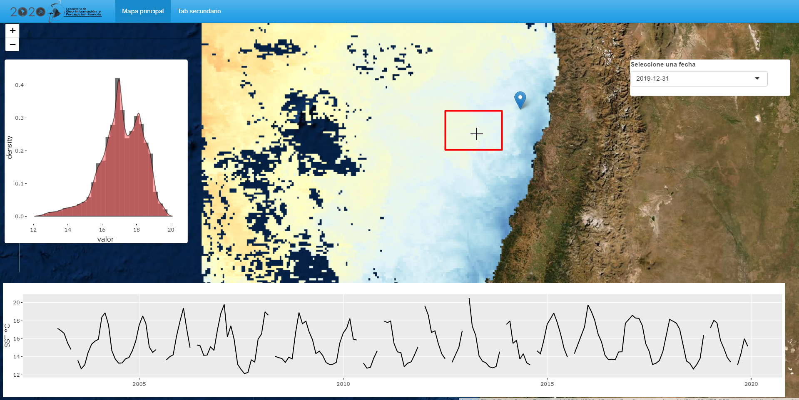

background-image: url(logo_labgrs_color.png)
background-position: center
background-size:40%

```{r setup, include=FALSE}
options(htmltools.dir.version = FALSE)
library(shiny)
library(leaflet)
library(tidyverse)
library(sf)
library(raster)
library(dygraphs)
library(shinythemes)
library(shinyalert)
library(ggfortify)
```


---

Librerías utilizadas en esta sesión

```{r eval=F}
library(shiny)
library(leaflet)
library(tidyverse)
library(sf)
library(raster)
library(dygraphs)
library(shinythemes)
library(ggfortify)
library(shinyalert)
```


---
class: inverse, center, middle

# INTRODUCCIÓN

---
#Metas de hoy

--
- Generar algunas mejoras de diseño de nuestra aplicación

--
- Resolver dudas o consultas generales
--
.center[

]
.center[.footnote[© Allison Horst]]

---
Seguiremos empleando nuestra aplicación de la semana anterior

.center[]

---
#Diseño de interfaz

--
- Partiremos por remover nuestro panel absoluto con el logo y pondremos el logo en la sección de nuestra barra de navegación.

--
- Agregaremos nuestra imagen en el argumento *title* usando la función *div* [Recuerde ver este enlace para más funciones HTML](https://shiny.rstudio.com/articles/tag-glossary.html)

--
```{r eval=F}
div(img(src = "logo_labgrs.png", style="margin-top: -14px; 
        padding-right:10px;padding-bottom:10px", height = 60))
```

--
.center[

]

---
#Panel condicional

--
- A veces hay elementos que no queremos que aparezcan de inmediato

--
- Este comportamiento lo podemos ajustar de varias maneras, una de ellas es el uso de un panel condicional

--
- Para esto, crearemos un panel absoluto donde pondremos la serie, que será contenida por un panel condicional. 

--
- Además haremos que el panel aparezca cuando exista el click en el mapa mediante la condición *input.map_click != 0*

--
```{r eval= F}
conditionalPanel(condition = 'input.map_click != 0',
                 absolutePanel(id="tSeries",
                 style="z-index:500;background-color: transparent;
                 opacity: 1;margin: auto;border-color: transparent;
                 padding-bottom: 2mm;padding-top: 1mm;",
                 class = "panel panel-default",
                 fixed = TRUE,draggable = F, top = 'auto', left = 5,
                 right = 10, bottom = 10,width = '100%', height = "auto",
                 dygraphOutput(outputId = 'ts',width = '98%',height = 250)
                 )
                 )
```

---
class: middle


---
# Mapa a full page usando *div*

--
- Ya logramos el panel condicional, ahora pondremos todo con un mapa usando toda la página.

--
- Para esto usaremos código CSS y la función *div*
--

- Pasando por ella todo el contenido de leaflet y nuestros paneles (controles y series)

---

--
```{r eval=F}
tabPanel('Mapa principal', # Main page view
         div(class="outer",
         tags$style(type = "text/css",".outer {position: fixed; top: 41px; left: 0;
                    right: 0; bottom: 0; overflow: hidden; padding: 0}"),
         leafletOutput(outputId = "map", width = "100%", height = "100%"), # Main map
         # Option panel
         absolutePanel(id = "controls", class = "panel panel-default", fixed = F,
                       draggable = F, top = 90, left = "auto", right = 20, bottom = "auto",
                       width = 300, height ="auto",
                       style="z-index:500;",
                       uiOutput('fechasInput')),# fechas input
         conditionalPanel(condition = 'input.map_click != 0',
                          absolutePanel(id="tSeries",
                          style="z-index:500;background-color: transparent;
                          opacity: 1;margin: auto;border-color: transparent;
                          padding-bottom: 2mm;padding-top: 1mm;",
                          class = "panel panel-default",
                          fixed = TRUE,draggable = F, top = 'auto', left = 5,
                          right = 10, bottom = 10,width = '100%', height = "auto",
                          dygraphOutput(outputId = 'ts',width = '98%',height = 250)
                          )
                          )
         )
         )
```

---

.center[

]

*¿Problemas?*

---
# Cambiemos dygraphs por plotly

--
- *Plotly* es otra librería que nos permite realizar gráficos interactivos de toda clase (series de tiempo, scatters, boxplots incluso mapas)


--
- Tiene compatibilidad con *ggplot2* y permite transformar gráficos creados desde esta librería o crearlos empleando las funciones de internas de plotly.

- Modifiquemos nuestro código (Recuerde agregar *plotly* al inicio de su aplicación)

--
```{r eval=F}
 conditionalPanel(condition = 'input.map_click != 0',
                  absolutePanel(id="tSeries",
                  style="z-index:500;background-color: transparent;
                  opacity: 1;margin: auto;border-color: transparent;
                  padding-bottom: 2mm;padding-top: 1mm;",
                  class = "panel panel-default",
                  fixed = TRUE,draggable = F, top = 'auto', left = 5,
                  right = 10, bottom = 10,width = '100%', height = "auto",
                  plotlyOutput(outputId = 'ts',width = '100%',height = 250))
                  )
```

---
#Creando el gráfico

--
- Ahora modificaremos el render de nuestro gráfico

--
```{r eval=F}
output$ts <- renderPlotly({
    ts.px <- ts(r.cell(),start = c(2003,1),end = c(2019,12),frequency = 12)
    g <- ts.px %>% autoplot(ylab = 'SST °C',asp = 0.2)
    #plot
    ggplotly(g)
  })
```

--
- La función *ggplotly()* permite transformar a HTML un objeto creado con ggplot2 (en este caso con autoplot)

---
class: middle, center




---
#Creando un gráfico con ggplot2

--
- Para mostrar la posibilidad de conversión, armaremos un gráfico de densitad de datos y lo pondremos en nuestra app usando un panel absoluto.

--
- Agregue el siguiente panel absoluto

--
```{r eval=F}
absolutePanel(id = "histo", class = "panel panel-default", fixed = F,draggable = F, top = 90,
              left = 10, right = 'auto', bottom = "auto",width = 400, height ="auto",style="z-index:500;",
              plotlyOutput('histogram'))
```

--
- Agreguemos la renderización al server

--
```{r eval=F}
output$histogram <- renderPlotly({
    req(input$fechas)
    n.col <- which(dates==input$fechas)
    #valor
    tabla1 <- tabla[,3:206]
    dates.value <- tabla1[,n.col] %>% as.data.frame()
    names(dates.value)<- 'valor' 
    #plot
    p <- ggplot(dates.value, aes(x = valor)) + geom_histogram(aes(y = ..density..), 
                                                              alpha = 0.7, fill = "#333333") + 
      geom_density(fill = "#ff4d4d", alpha = 0.5) + theme(panel.background = element_rect(fill = '#ffffff'))
    ggplotly(p)
  })
```

---
class: middle, center


---
#Íconos y modals

--
- En shiny podemos modificar los íconos de ciertos elementos, lo más común es modificar los **actions buttons**

--
- Agregaremos un botón de acción a nuestra lista de fechas en la UI

--
```{r eval = F}
absolutePanel(id = "controls", class = "panel panel-default", fixed = F,
              draggable = F, top = 90, left = "auto", right = 20, bottom = "auto",
              width = 300, height ="auto",
              style="z-index:500;",uiOutput('fechasInput'),
              actionButton("infoInput", "Info"))

```

.center[

]

---
# Modificando el ícono

--
- Para modificar los íconos en shiny podemos emplear la función *icon()* dentro del botón y podemos emplear las librerías de fuentes [*Font Awesome Free*](https://fontawesome.com/) y [*Glyphicons*](https://getbootstrap.com/docs/4.5/components/alerts/)

--
```{r eval = F}
absolutePanel(id = "controls", class = "panel panel-default", fixed = F,
              draggable = F, top = 90, left = "auto", right = 20, bottom = "auto",
              width = 350, height ="auto",
              style="z-index:500;",
              uiOutput('fechasInput'),actionButton("infoInput", icon("info-circle"),
              style="background-color:#ecf0f1;border color:#ecf0f1",width = "30px"))
```

--
.center[ 

]

---
#Creando el modal en el server

--
- Para poder hacer funcionar nuestro texto con información usaremos un *observeEvent()*

--
```{r eval = F}
  #modals
  observeEvent(input$infoInput, {
    showModal(modalDialog(h5("Seleccione una de las fechas del listado para desplegar la temperatura superficial del mar MODIS Aqua (4 km)"),footer = NULL,easyClose = T,size = 'l',fade = T))
  })
```

--
.center[

]

---
# Usando shinyalert

--
- De la misma forma que podemos usar los modals de shiny, tenemos algunas librerías que extienden las capacidadesd de los modals.

--
- Esto permite una UI mucho más atractiva a la vista. 

--
- Reemplacemos el ejemplo anterior, debemos poner la función *useShinyalert()* reemplazando nuestro botón de acción.

--
```{r eval=F}
##shiny alert modal
shinyalert(text = paste('<h4 style="text-align:left; color: black">',
                        "1.-Seleccione una fecha disponible para cambiar el mapa y el gráfico","</h4>", "</br>",
                        '<h4 style="text-align:left; color: black">',
                        "2.- Haga click en algun pixel para obtener la serie de tiempo","</h4>", "</br>"),
           type = 'info',html = T,
           animation = "slide-from-bottom")
```

---
class: middle, center


---
#Cursor en leaflet

--
- Para facilitar ciertas cosas leaflet tiene configurados sus cursores si tenemos shapes u otras entidades.

--
- No obstante, podemos realizar modificaciones y elegir el cursor en el mapa dependiendo de nuestro interés.

--
- Para esto usaremos la función tags$style en nuestro código de la UI ([Para ver los tipos de cursores](https://www.quackit.com/html/codes/html_cursor_code.cfm))

--
```{r eval=F}
tags$style('#map { cursor: crosshair;}')
```

---
class: middle, center



---
# ShinyJS

--
- *shinyjs* permite ejecutar funciones comunes y útiles de JavaScript en shiny, permitiendo mejorar el funcionamiento y la visual de nuestra interfaz de usuario.

--
- ¿Qué podemos hacer?
 + Ocultar o mostrar elementos
 + Desactivar u ocultar un input
 + Resetear entradas
 + Etc.
 
--
- ejemplo aplicado: ocultando una entrada


- Para esto debemos usar la función *useShinyjs()* en nuestro código de la UI y agregaremos un checkbox para controlar la aparición de nuestro panel.

---
--
En la UI

--
```{r eval=F}
absolutePanel(id = "controls", class = "panel panel-default", fixed = F,
              draggable = F, top = 90, left = "auto", right = 20, bottom = "auto",
              width = 350, height ="auto",
              style="z-index:500;",
              uiOutput('fechasInput'),
              checkboxInput("show",'Mostrar gráfico',value = F),
              useShinyalert())
```

--
En el server

--
```{r eval=F}
##render plot panel
  observe({
    if(input$show == F){
      shinyjs::hide('histo')
    }else{
      shinyjs::show('histo')
    }
  })
```


---
class: inverse,center, middle

# ¿PREGUNTAS?


---

class: inverse,center, middle

# PRÓXIMA SEMANA SEGUIMOS <br> DESPLIEGUE <br> 

