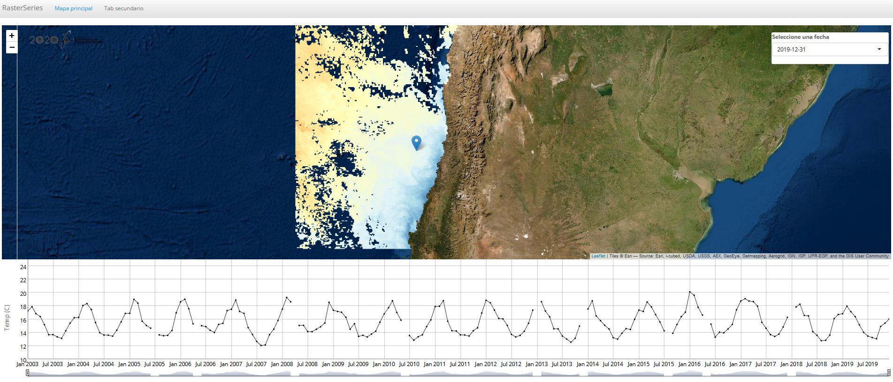
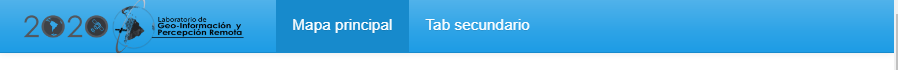
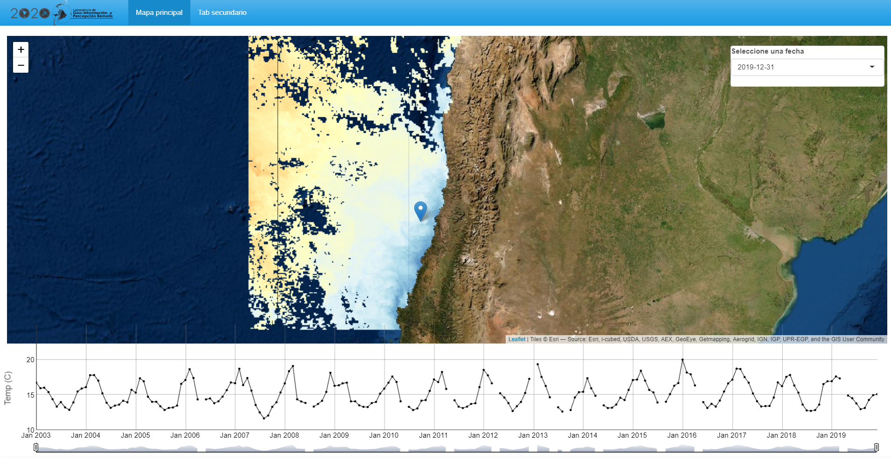
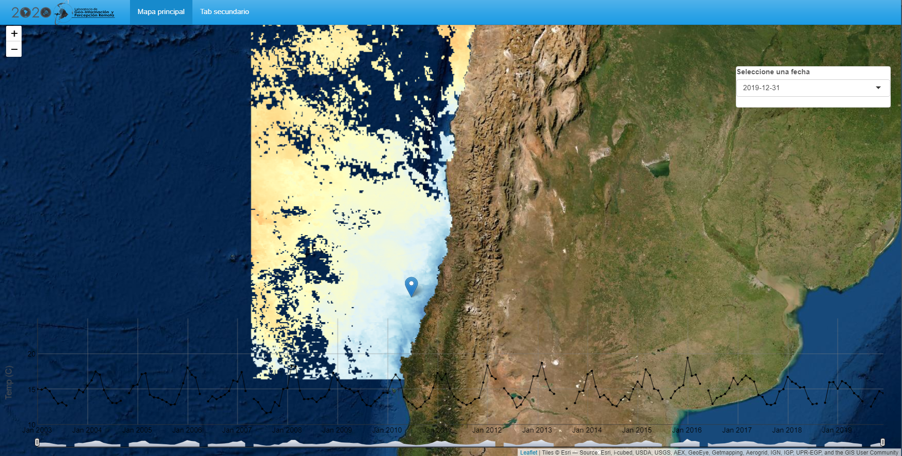

background-image: url(logo_labgrs_color.png)
background-position: center
background-size:40%

```{r setup, include=FALSE}
options(htmltools.dir.version = FALSE)
library(shiny)
library(leaflet)
library(tidyverse)
library(sf)
library(raster)
library(dygraphs)
library(shinythemes)
library(ggfortify)
```


---

Librerías utilizadas en esta sesión

```{r eval=F}
library(shiny)
library(leaflet)
library(tidyverse)
library(sf)
library(raster)
library(dygraphs)
library(shinythemes)
library(ggfortify)
```


---
class: inverse, center, middle

# INTRODUCCIÓN

---
# Summary

--
- Hasta el momento hemos visto como estructurar aplicaciones

--
- Hemos creado y empleado funciones

--
- Hemos empleado widgets y elementos reactivos

--
- Hemos visto algunas configuraciones de páginas

--
- Series de tiempo y shiny con dygraphs

--
- Subida y bajada de archivos en shiny

---
#Metas de hoy

--
- Generar algunas mejoras de diseño de nuestra aplicación

--
- Resolver dudas o consultas generales
--
.center[

]
.center[.footnote[© Allison Horst]]

---
Seguiremos empleando nuestra aplicación de la semana anterior

.center[]

---
#Diseño de interfaz

--
- Partiremos por remover nuestro panel absoluto con el logo y pondremos el logo en la sección de nuestra barra de navegación.

--
- Agregaremos nuestra imagen en el argumento *title* usando la función *div* [Recuerde ver este enlace para más funciones HTML](https://shiny.rstudio.com/articles/tag-glossary.html)

--
```{r eval=F}
div(img(src = "logo_labgrs.png", style="margin-top: -14px; 
        padding-right:10px;padding-bottom:10px", height = 60))
```

--
.center[

]

---
#Serie de tiempo en panel absoluto condicional

--
- A veces hay elementos que no queremos que aparezcan de inmediato

--
- Esto podemos hacerlo de diversas maneras, pero una de las mejores es trabajar sobre un panel condicional

--
- Para esto, crearemos un panel absoluto que será contenido por un panel condicional. 

--
- Además haremos que el panel aparezca cuando exista el click en el mapa mediante *input.map_click != 0*

--
```{r eval= F}
conditionalPanel(condition = 'input.map_click != 0',
                 absolutePanel(id="tSeries",
                 style="z-index:500;background-color: transparent;
                 opacity: 1;margin: auto;border-color: transparent;
                 padding-bottom: 2mm;padding-top: 1mm;",
                 class = "panel panel-default",
                 fixed = TRUE,draggable = F, top = 'auto', left = 5,
                 right = 10, bottom = 10,width = '100%', height = "auto",
                 dygraphOutput(outputId = 'ts',width = '98%',height = 250)
                 )
                 )
```

---
class: middle


---
# Mapa a full page usando *div*

--
- Ya logramos el panel condicional, ahora pondremos todo con un mapa usando toda la página.

--
- Para esto usaremos código CSS y la función *div*
--

- Pasando por ella todo el contenido de leaflet y nuestros paneles (controles y series)

---

--
```{r eval=F}
tabPanel('Mapa principal', # Main page view
         div(class="outer",
         tags$style(type = "text/css",".outer {position: fixed; top: 41px; left: 0;
                    right: 0; bottom: 0; overflow: hidden; padding: 0}"),
         leafletOutput(outputId = "map", width = "100%", height = "100%"), # Main map
         # Option panel
         absolutePanel(id = "controls", class = "panel panel-default", fixed = F,
                       draggable = F, top = 90, left = "auto", right = 20, bottom = "auto",
                       width = 300, height ="auto",
                       style="z-index:500;",
                       uiOutput('fechasInput')),# fechas input
         conditionalPanel(condition = 'input.map_click != 0',
                          absolutePanel(id="tSeries",
                          style="z-index:500;background-color: transparent;
                          opacity: 1;margin: auto;border-color: transparent;
                          padding-bottom: 2mm;padding-top: 1mm;",
                          class = "panel panel-default",
                          fixed = TRUE,draggable = F, top = 'auto', left = 5,
                          right = 10, bottom = 10,width = '100%', height = "auto",
                          dygraphOutput(outputId = 'ts',width = '98%',height = 250)
                          )
                          )
         )
         )
```

---

.center[

]

*¿Problemas?*
---
class: inverse,center, middle

# ¿PREGUNTAS?


---

class: inverse,center, middle

# PRÓXIMA SEMANA SEGUIMOS <br> MEJORANDO NUESTRA APP <br> 

