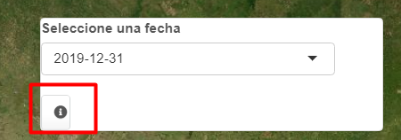

background-image: url(logo_labgrs_color.png)
background-position: center
background-size:40%

```{r setup, include=FALSE}
options(htmltools.dir.version = FALSE)
library(shiny)
library(shinyjs)
library(leaflet)
library(tidyverse)
library(sf)
library(raster)
library(shinythemes)
library(ggfortify)
library(plotly)
library(shinyalert)
```


---
Librerías utilizadas en esta sesión

```{r eval=F}
library(shiny)
library(shinyjs)
library(leaflet)
library(tidyverse)
library(sf)
library(raster)
library(shinythemes)
library(ggfortify)
library(plotly)
library(shinyalert)
```

---
class: inverse, center, middle

# INTRODUCCIÓN

---
#Metas de hoy

--
- Seguiremos mejorando nuestra aplicación

--
- Agregaremos botones e íconos y algunos elementos adicionales de diseño
--
.center[

]
.center[.footnote[© Allison Horst]]

---
Seguiremos empleando nuestra aplicación de la semana anterior

.center[]

---
#Íconos y modals

--
- En shiny podemos modificar los íconosde ciertos elementos, lo más común es modificar los actions buttons

--
- Agregaremos un botón de acción a nuestra lista de fechas en la UI

--
```{r eval = F}
absolutePanel(id = "controls", class = "panel panel-default", fixed = F,
              draggable = F, top = 90, left = "auto", right = 20, bottom = "auto",
              width = 300, height ="auto",
              style="z-index:500;",uiOutput('fechasInput'),
              actionButton("infoInput", "Info"))

```

.center[

]

---
# Modificando el ícono

--
- Para modificar los íconos en shiny podemos emplear la función *icon()* dentro del botón y podemos emplear las librerías de fuentes [*Font Awesome Free*](https://fontawesome.com/) y [*Glyphicons*](https://getbootstrap.com/docs/4.5/components/alerts/)

--
```{r eval = F}
absolutePanel(id = "controls", class = "panel panel-default", fixed = F,
              draggable = F, top = 90, left = "auto", right = 20, bottom = "auto",
              width = 350, height ="auto",
              style="z-index:500;",
              uiOutput('fechasInput'),actionButton("infoInput", icon("info-circle"),
              style="background-color:#ecf0f1;border color:#ecf0f1",width = "30px"))
```

--
.center[ 

]

---
#Creando el modal en el server

--
- Para poder hacer funcionar nuestro texto con información usaremos un *observeEvent()*

--
```{r eval = F}
  #modals
  observeEvent(input$infoInput, {
    showModal(modalDialog(h5("Seleccione una de las fechas del listado para desplegar la temperatura superficial del mar MODIS Aqua (4 km)"),footer = NULL,easyClose = T,size = 'l',fade = T))
  })
```

--
.center[

]

---
# Usando shinyalert

--
- De la misma forma que podemos usar los modals de shiny, tenemos algunas librerías que extienden las capacidadesd de los modals.

--
- Esto permite una UI mucho más atractiva a la vista. 

--
- Reemplacemos el ejemplo anterior, debemos poner la función *useShinyalert()* reemplazando nuestro botón de acción.

--
```{r eval=F}
##shiny alert modal
shinyalert(text = paste('<h4 style="text-align:left; color: black">',
                        "1.-Seleccione una fecha disponible para cambiar el mapa y el gráfico","</h4>", "</br>",
                        '<h4 style="text-align:left; color: black">',
                        "2.- Haga click en algun pixel para obtener la serie de tiempo","</h4>", "</br>"),
           type = 'info',html = T,
           animation = "slide-from-bottom")
```

---
class: middle, center


---
#Cursor en leaflet

--
- Para facilitar ciertas cosas leaflet tiene configurados sus cursores si tenemos shapes u otras entidades.

--
- No obstante, podemos realizar modificaciones y elegir el cursor en el mapa dependiendo de nuestro interés.

--
- Para esto usaremos la función tags$style en nuestro código de la UI ([Para ver los tipos de cursores](https://www.quackit.com/html/codes/html_cursor_code.cfm))

--
```{r eval=F}
tags$style('#map { cursor: crosshair;}')
```

---
class: middle, center


---
#Insertar elementos html en shiny

---
# ShinyJS

---
class: inverse,center, middle

# ¿PREGUNTAS?


---

class: inverse,center, middle

# PRÓXIMA SEMANA SEGUIMOS <br> MEJORANDO NUESTRA APP <br> 

