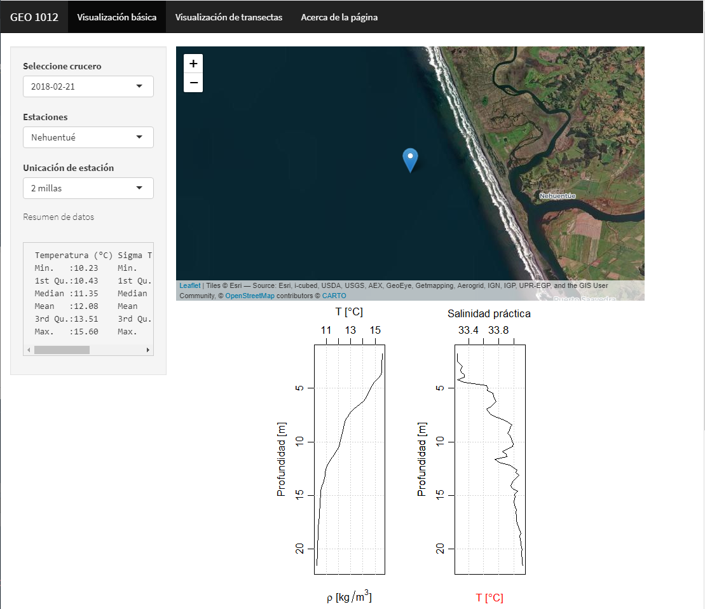

background-image: url(logo_labgrs_color.png)
background-position: center
background-size:40%

```{r setup, include=FALSE}
options(htmltools.dir.version = FALSE)
library(shiny)
library(shinyjs)
library(leaflet)
library(tidyverse)
library(sf)
library(raster)
library(shinythemes)
library(ggfortify)
library(plotly)
library(shinyalert)
```


---
Librerías utilizadas en esta sesión

```{r eval=F}
library(shiny)
library(shinyjs)
library(leaflet)
library(tidyverse)
library(sf)
library(raster)
library(shinythemes)
library(ggfortify)
library(plotly)
library(shinyalert)
```

---
class: inverse, center, middle

# INTRODUCCIÓN

---
#Metas de hoy

--
- Desplegar nuestra aplicación en la web

--
- Dudas y consultas
--
.center[

]
.center[.footnote[© Allison Horst]]

---
Seguiremos empleando nuestra aplicación de la semana anterior

.center[]

---
#Insertar HTML

---
#Métodos locales

--
- Compartir el script y los datos: Esta es la forma más convencional de compartir una app y simplemente consiste en compartir los archivos que hacen funcionar nuestra aplicación para que los usuarios la puedan correr localmente.

--
- Compartir URL: otra forma es zippear la aplicación y alojarla en algún sitio (GoogleDrive, Dropbox u otro) y compartir la url para que los usuarios puedan acceder al archivo de la siguiente manera:

```{r eval=F}
runUrl("<url al zip>")
```

---
#Github

--
De manera complementaria uno puede alojar sus aplicaciones en GitHub o en Gist y puede dar acceso a las mismas considerando el nombre de repositorio y la app para que los usuarios puedan acceder. 

--
```{r eval=F}
runGitHub( "geo1015", "JoseLastra")
```

---
class: middle, center


---
#En la web

Una forma de compartir es simplemente alojar nuestra aplicación en un servicio y poder ponerla a disposición en un servidor externo o propio.Existen varias opciones donde las más comunes son el uso de:

--
- [Shinyapps.io](https://www.shinyapps.io/): Una de las formas más fáciles de subir trabajando directamente desde RStudio.

--
- [Shiny Server](https://rstudio.com/products/shiny/shiny-server/): Es un programa complementario que permite configurar un servidor para el alojamiento y despliegue de aplicaciones. Necesitará un servidor Linux con Ubuntu 12.04 o superior (64 bits) y CentOS / RHEL 5 (64 bits) para poder operar Shiny Server.

--
- [RStudio Connect](https://rstudio.com/products/connect/): es una plataforma de publicación para el trabajo que crean sus equipos en R y Python. Contempla no solo shiny apps sino que también otros productos (informes de R Markdown, Plumber APIs, dashboards, Jupyter Notebooks, contenido interactivo de Python).


---
#Desplegando en Shinyapps.io

--
- Antes de comenzar es importante disponer de una cuenta gratuita en [Shinyapps.io](https://www.shinyapps.io/)

--
- Con nuestra cuenta activa, debemos instalar la librería rsconnect que nos permitirá subir nuestras aplicaciones directamente desde RStudio.

--
```{r eval=F}
install.packages('rsconnect')
```

--
- Una vez instalada, la cargaremos en nuestro entorno mediante la función `library(rsconnect)`. 

--
- Ahora, iremos a nuestra cuenta de shinyapps.io y en nuestro perfil debemos ubicar la opción Tokens donde encontraremos una ventana con varios códigos para nuestra cuenta.

---
class: middle, center

---

-
Aquí, oprimiremos la opción *Show secret* para que nos muestre los valores necesarios y los copiaremos en nuestro portapapeles.

--
.center[

]

--
- Para conectar nuestra cuenta, abriremos primero nuestra aplicación de sitios turísticos la desplegaremos (Run App) y buscaremos el botón de publicación.

.center[

]

---

--
- Si disponemos de una cuenta ya conectada, por defecto nos dará la opción de publicarla en esa cuenta pero sino hemos vinculado nada debemos proceder a conectarla usando la información que pegamos desde los *Tokens*.

--
.center[

]

---
.center[

]

--
- Con la cuenta conectada, debemos seleccionar los archivos a montar sobre nuestro sitio, el título de la aplicación y ver la cuenta de conexión (en caso de disponer de varias).

---
class: middle, center


---
class: middle, center


---
class: inverse,center, middle

# ¿PREGUNTAS?


---

class: inverse,center, middle

# PRÓXIMA SEMANA <br> COMPARTIMOS NUESTRA APP <br> 

