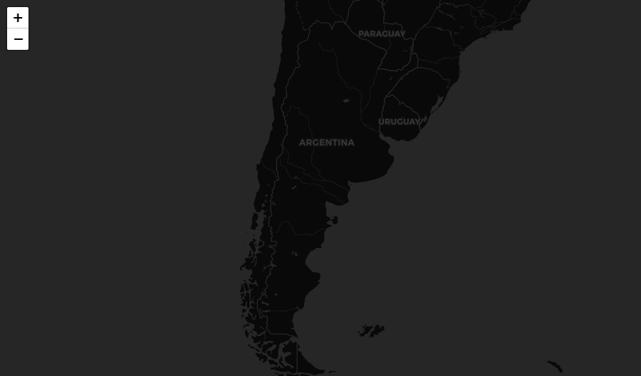

background-image: url(logo_labgrs_color.png)
background-position: center
background-size:40%

```{r setup, include=FALSE}
options(htmltools.dir.version = FALSE)
library(shiny)
library(leaflet)
library(tidyverse)
library(sf)
library(shinybusy)
```


---

Librerías utilizadas en esta sesión

```{r eval=F}
library(shiny)
library(leaflet)
library(tidyverse)
library(sf)
library(shinybusy)
```


---
class: inverse, center, middle

# INTRODUCCIÓN

---
#Creando funciones

--
- La creación de una función específica es útil para limpiar el código dentro de nuestra aplicación (siempre que se pueda)

--

> To understand computations in R, two slogans are helpful:
- Everything that exists is an object, and
- Everything that happens is a function call.

.footnote[John Chambers creador de R, en Advanced R (2019) 2da Edición, p. 79.]

---
#Creando una aplicación simple

--
- Usando información de los micro datos del Censo 2017 para la comuna de Viña del mar (*viña_del_mar.gpkg*) obtenida desde [INE](https://geoine-ine-chile.opendata.arcgis.com/), crearemos una app donde usaremos:

--
- Código *HTML* y *CSS* empleando la función *tag()*

--
- Funciones y conductores reactivos (reactives y observers)

--
- Crearemos una función auxiliar  con funciones condicionales y la emplearemos dentro del código.

.center[

.footnote[© Allison Horst]
]


---
#UI base

--
```{r eval=F}
library(shiny)
library(leaflet)
library(tidyverse)
library(sf)
library(shinybusy)

ui <- bootstrapPage(
  tags$style(type = "text/css", "html, body {width:100%;height:100%}"), #esto hace la magia
  leafletOutput('map', width = "100%", height = "100%")
  )
```


---
#Server base

--
```{r eval=F}
server <- function(input, output, session) {
  #Load data
  shp <- read_sf('data/viña_del_mar.gpkg') %>% st_transform(4326)
  ## rendering base map
  output$map <- renderLeaflet({
    leaflet() %>% addProviderTiles(providers$CartoDB.DarkMatter)
  })
}
```

--
Para una visualización previa de los proveedores de imágenes base [click aquí](http://leaflet-extras.github.io/leaflet-providers/preview/index.html)

---
class: center



---
#Añadiendo opciones

--
- Agregaremos un panel donde pondremos nuestras opciones

--
- Importante conocer esto sobre los paneles y su posición en la página [Más info.](https://leafletjs.com/reference-1.7.1.html#map-pane)

--
- Usaremos un panel que irá sobre nuestro mapa e iremos incorporando opciones en el.

--
```{r, eval=F}
absolutePanel(id="controls",
                style="z-index:500;", top = 90, left = "auto", right = 20, 
                bottom = "auto",
                width = 400, height ="auto",
                class = "panel panel-default",
                selectInput(inputId = 'campo',label = 'Seleccione variable a visualizar',
                            choices = list('Total personas' = 'PERSONAS',
                                           'Densidad (per/ha)'='DENSIDAD',
                                           'Viviendas'='TOTAL_VIVI')),
                actionButton('plot',label = 'Presione para ver el histograma'),
                plotOutput('grafico')
                )
```

---
# SERVER

--
Primero añadiremos la capa de Viña del Mar sin considerar los inputs y luego usaremos las opciones para modificarla

--
```{r eval=F}
 ## rendering base map
  output$map <- renderLeaflet({
    leaflet() %>% addProviderTiles(providers$CartoDB.DarkMatter) %>% 
      addPolygons(data = shp,group = 'Manzanas') %>%
      addLayersControl(overlayGroups = 'Manzanas',position = 'topleft')
  })
```

---
class: middle, center


---
# Importante

--
- Para modificar la información del mapa sin que se recarge completo cada vez, usaremos la función **leafletProxy()**

--
- Además usaremos nuestros primeros condicionales para operar sobre el proxy

--
- Veremos la utilidad de los observers aplicados a un mapa web

--

```{r eval=F}
  ## rendering base map
  output$map <- renderLeaflet({
    leaflet() %>% addProviderTiles(providers$CartoDB.DarkMatter) %>% 
      fitBounds(lng1 =-71.586 ,lat1 =-33.105 ,lng2 =-71.45 ,lat2 = -32.944) %>%
      addLayersControl(overlayGroups = 'Manzanas',position = 'topleft')
  })
```

---
# Creando nuestro mapa dinámico

--
- Crearemos un objeto reactivo utilizando *eventReactive({})*, que filtrará nuestra capa original de información de acuerdo al campo elegido por el usuario.

--
```{r eval = F}
#shape reactivo
shp_filter <- eventReactive(input$campo,{ 
    req(input$campo) 
    capa <- shp %>% dplyr::select(input$campo[[1]])
    names(capa) <-c('columna','geom')#renombrar campos para generalizar la capa
    capa 
  })
```

--
- Usaremos *observeEvent({})* como conductor reactivo de los cambios en la UI

--
- Primero crearemos los elementos dinámicos para mostrar con colores la información

--
- Y crearemos un objeto de nombre *proxyMap*

---
```{r eval = F}
observeEvent(input$campo, {
    #preparando paletas
    tabla <- shp_filter() %>% as.data.frame() 
    dominio <- tabla[, 'columna']
    pal <- colorBin(palette = "viridis",domain = dominio)
    
    proxyMap <- leafletProxy('map') %>% clearShapes() %>% clearControls()
        })
```

--
- El siguiente paso es definir los condicionales dentro del observer

--
- Para esto usaremos la función *if()*


---
#Revisemos

--
- Para asegurar la disposición correcta de la información del campo en la leyenda, crearemos un objeto que contendrá el título correspondiente, según el input del usuario empleando el condicional *if()*

--
- Ya que la capa está generalizada, no es necesario crear múltiples mapas reactivos sino uno solo y configurar los objetos dinámicos a cambiar.

--
```{r eval=F}
#condicionales para título de leyenda
    if(input$campo[[1]] == 'PERSONAS'){
      titulo <- 'Total población por manzana'
    }
    if(input$campo[[1]] == 'Densidad'){
      titulo <- 'Densidad por manzana (personas/hectárea)'
    }
    if(input$campo[[1]] == 'TOTAL_VIVI'){
      titulo <- 'Total viviendas por manzana'
    }
```


---
```{r eval=F}
 #proxy map changes
  observeEvent(input$campo, {
    #preparando paletas
    tabla <- shp_filter() %>% as.data.frame() 
    dominio <- tabla[, 'columna']
    #creando paleta de colores dinámica
    pal <- colorBin(palette = "viridis",domain = dominio)
    #proxy Map
    proxyMap <- leafletProxy('map') %>% clearShapes() %>% clearControls()
    
    if(input$campo[[1]] == 'PERSONAS'){
      titulo <- 'Total población por manzana'
    }
    if(input$campo[[1]] == 'DENSIDAD'){
      titulo <- 'Densidad por manzana (personas/hectárea)'
    }
    if(input$campo[[1]] == 'TOTAL_VIVI'){
      titulo <- 'Total viviendas por manzana'
    }
     proxyMap <- proxyMap %>% 
        addPolygons(data = shp_filter(),group = 'Manzanas', fillColor = ~pal(columna), fillOpacity = 0.7,
                    stroke = 0.1,color = 'white',weight = 1, smoothFactor = 0.2) %>% 
       addLegend("bottomleft",pal = pal, values = dominio, title = titulo, opacity = 0.8,group = 'Leyenda') 
 
    #print map
    proxyMap
  })
```

---
#Creemos una primera función 

--
- Las funciones auxiliares nos permiten modularizar código para ahorrar la carga sobre el script principal de la app

--
- Nos permiten reutilizar código facilmente y optimizar el desarrollo y el debugging.

--
- El script de la función se verá de la siguiente manera, considerando la opción para plotear:

--
```{r eval=F}
dataPlot <- function(){
  
}
```

---
#Armando la función

--
- Para este ejemplo realizaremos una función gráfica que requerirá dos argumentos: *(1) campo* y *(2) shp*

--
- Dentro simplemente armaremos un código genérico para un histograma.

--
```{r}
dataPlot <- function(datos , campo){

  ggplot(data = datos, aes_string(x = campo)) + geom_histogram() + theme_bw() +
    xlab(campo) + ylab('Frecuencia')
}
```

--
- Este script lo guardaremos en el mismo directorio de la aplicación, con el nombre *dataPlot.R*

---
# Usando la función en nuestra app

--
- Para cargar la función usaremos `source('dataPlot.R')`, idealmente antes de la UI.

--
- Luego renderizaremos nuestro gráfico

```{r eval=F}
  output$grafico <- renderPlot({
      req(input$plot)
      campo <- isolate({input$campo[[1]]})
      dataPlot(datos = shp,campo = campo)
  })
```

---
class: middle, center

---
class: inverse,center, middle

# ¿PREGUNTAS?


---

class: inverse,center, middle

# PRÓXIMA SEMANA SEGUIMOS <br> MEJORANDO NUESTRA APP <br> 

