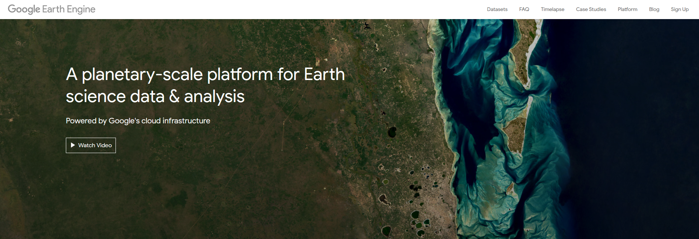
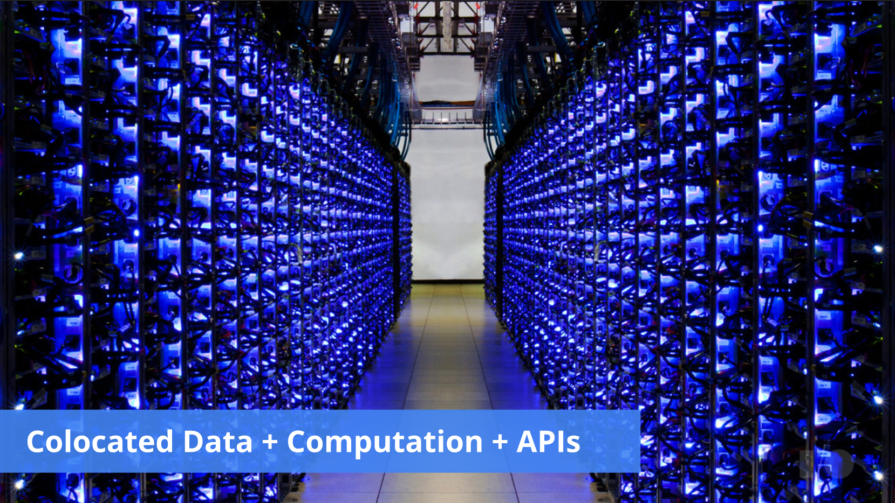
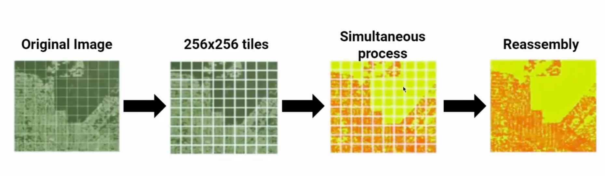
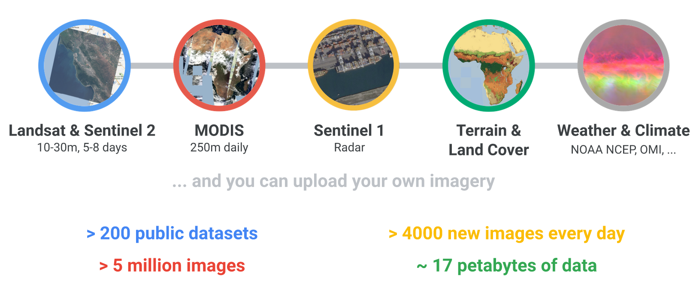
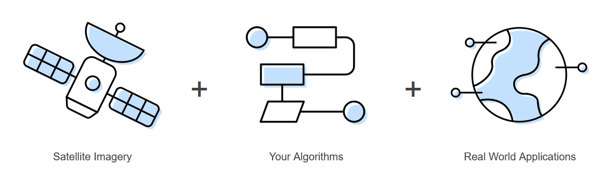

background-image: url(logo_labgrs_color.png)
background-position: center
background-size:40%

```{r setup, include=FALSE}
options(htmltools.dir.version = FALSE)
library(DT)
library(tidyverse)
```


---
# ¿Qué es GEE?

--
- Es una plataforma en el cloud para el análisis de datos geoespaciales terrestres

--
- Los datos pueden venir de modelos climáricos percepción remota u otras fuentes

--
- La idea general es facilitar el análisis computacional y colaborar en el desarrolllo de resultados.

--
.center[
]

---
class: middle, center

.left[
.footnote[
- Servidores dedicados
- más de 20 petabytes de datos
- Dos APIs para trabajar: JavaScript y Python
]
]

---
#¿Cómo se procesan los datos?

--
- De manera simple, lo que se realiza es una paralelización de la información.

--
- Los datos se dividen en tiles de que son enviados, procesados y reensamblados al finalizar.

--
- No es funcional para procesos dependientes del entorno

--
.center[
]
.center[[Gorelick *et al.*, 2017](https://www.sciencedirect.com/science/article/pii/S0034425717302900#f0010)]

---
#Catálogo

--
.center[]

--
.center[[Catálogo](https://developers.google.com/earth-engine/datasets)]

---
# En este curso

--
- Usaremos el Code Editor (GUI), desde donde podremos acceder a distitntos datos y funciones de procesamiento como:

--
  + Image
  + Image Collection
  + Geometries
  + Filter
  + Reducer
  + Random Forest

--
- Entre los miles de datos y funciones disponibles.

--
- Para estar al corriente de las nuevos datos y algoritmos:

  + [Medium](https://medium.com/google-earth)
  + [Remote Sensing](https://www.mdpi.com/journal/remotesensing/special_issues/GEE)
  
---
# ¿Qué podemos hacer con GEE?

.left[
- Obtener *una* imagen

- Aplicar un algoritmo a 
una imagen

- Usar una colección de 
imágenes

- Map sobre una colección

- Aplicar reducciones

- Etc...
] 

.center[

]

---
# Ventajas y desventajas
```{r echo=F,warning=F,message=F,error=F}
tabla <- read_csv('tabla.csv')

datatable(tabla,class = 'cell-border stripe',rownames = F,options = list(pageLength=5))
```

---

class: inverse,center, middle

# ¿PREGUNTAS?

---
background-image: url(logo_pucv.png)
background-position: center
background-size:40%


