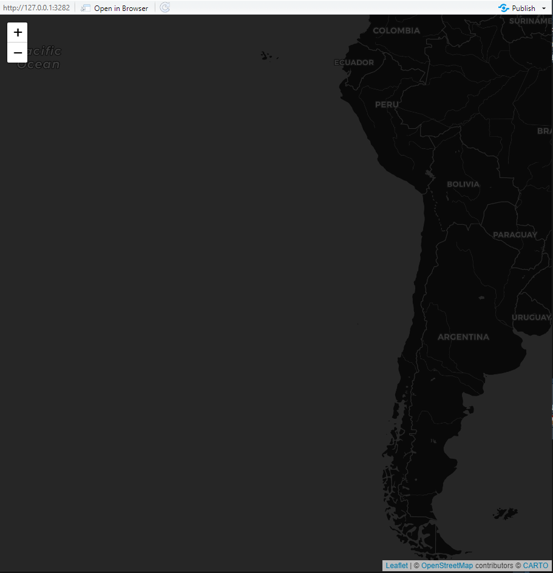
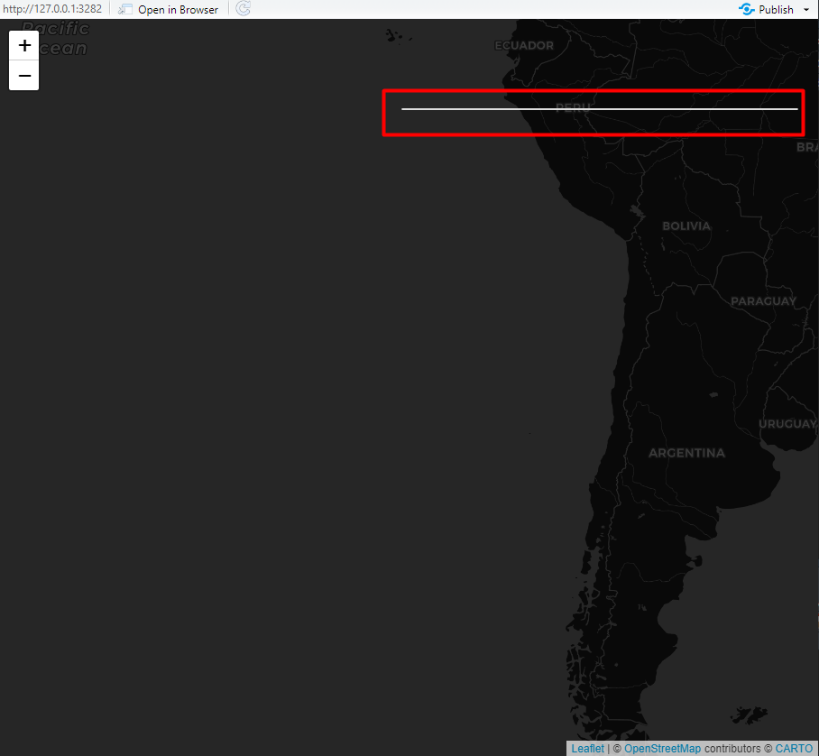
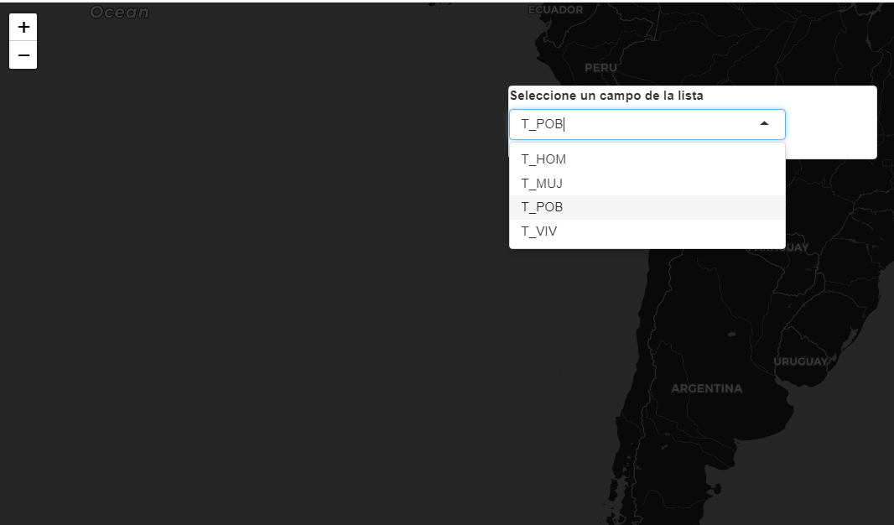
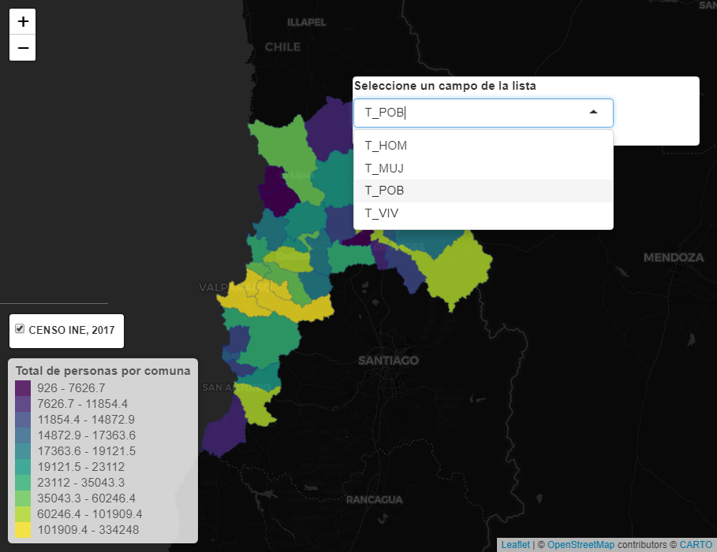
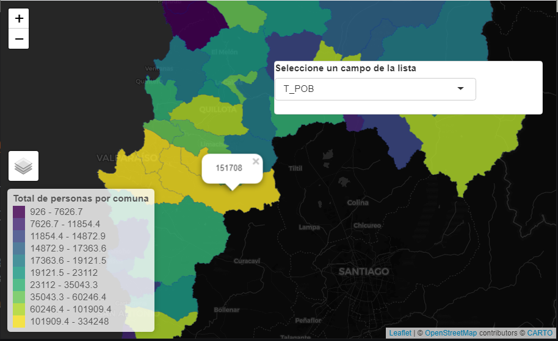
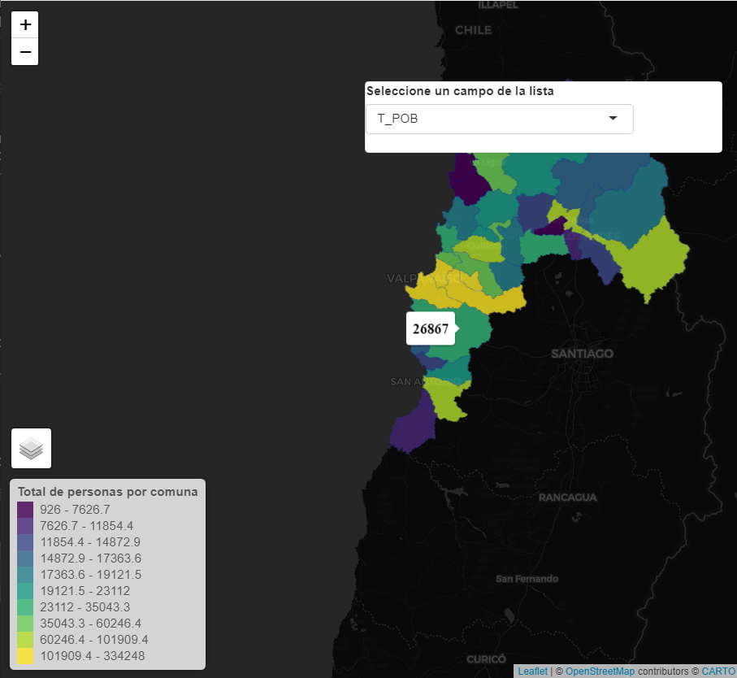
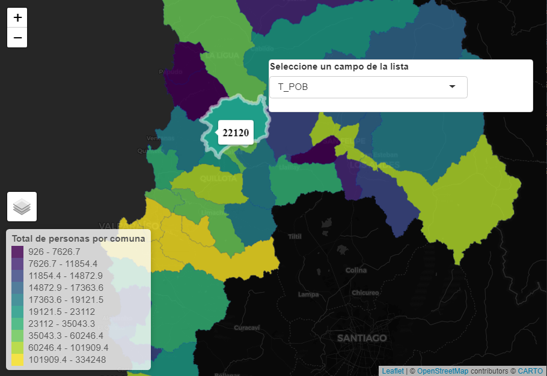

background-image: url(logo_labgrs_color.png)
background-position: center
background-size:40%

```{r setup, include=FALSE}
options(htmltools.dir.version = FALSE)
library(tidyverse)
library(sf)
library(rgdal)
library(raster)
library(plotly)
library(leaflet)
library(kableExtra)

```


---

Librerías utilizadas en esta sesión

```{r eval=F}
library(shiny)
library(tidyverse)
library(sf)
library(rgdal)
library(raster)
library(plotly)
library(leaflet)
```

---
# Estructurando nuestra app

--
- De momento, hemos utilizado la página fluída (fluidPage) en nuestra aplicación inicial con datos.

--
- Una mejor alternativa es el uso de las páginas de tipo bootstrap (bootstrapPage) ya que:
  + Se integra eficientemente con JavaScript (sobre todo si posteriormente personalizamos nuestra página)
  + Compatibe con la mayoría de los navegadores
  + Responsive

---
# Diagrama general

--
- Primero configuraremos el cuerpo general del script y para poder emplear nuestro mapa a página completa emplearemos *tags*

--
- Nuestro mapa base lo haremos con *leatletOutput()*

--
- Leeremos nuestras capas de información vectorial y la reproyectaremos de inmediato para operar en leaflet

---
```{r eval=F}
library(shiny)
library(tidyverse)
library(sf)
library(rgdal)
library(raster)
library(plotly)
library(leaflet)
########### UI #######################
ui <- bootstrapPage(
  tags$style(type = "text/css", "html, body {width:100%;height:100%}"),
  leafletOutput('map', width = "100%", height = "100%")
)
############SERVER###################
server <- function(input, output, session) {
  #Load data
  valpo <- read_sf('censoINE_Valparaiso2017.gpkg') %>% st_transform(4326)
  ## rendering base map
  output$map <- renderLeaflet({
    leaflet() %>% addProviderTiles(providers$CartoDB.DarkMatter) %>% 
      fitBounds(lng1 =-109.5 ,lat1 =-33.96 ,lng2 =-69.9 ,lat2 = -26.29) #ajustar extensión inicial del mapa
  })
}
##########Compile####################
shinyApp(ui,server)
```

--
- *fitBounds()* nos permite fijar la extensión inicial del mapa base

---
class: middle, center


---
# Antes de empezar

- Además de utilizar eventos puestos en la UI (sliders, select inputs, acction buttons, etc.), podemos hacer uso de eventos de mapa y objeto para pasarlos por el server.

--
- Los eventos de objeto se configuran así `input$MAPID_OBJCATEGORY_EVENTNAME` donde:
  + MAPID: nombre del mapa;
  + OBJCATEGORY: tipo de elemento para pasaro por el evento reactivo (marker, shape, geojson o topojson);
  + EVENTNAME: reacción al mouse (click, mouseover y mouseout)

--
- Los eventos de mapa se configuran así `input$MAPID_EVENTNAME` donde las opciones de evento disponibles son:
  + Click;
  + Bounds;
  + Zoom;
  + Center;

- Usaremos algunos de estos eventos durante el desarrollo de nuestra aplicación

---
# Incorporando Elementos en la UI

--
- Agregaremos un panel donde pondremos nuestras opciones

--
- Importante conocer esto sobre los paneles y su posición en la página [Más info.](https://leafletjs.com/reference-1.7.1.html#map-pane)

--
- Usaremos un panel que irá sobre nuestro mapa e iremos incorporando opciones en el. 

--
```{r, eval=F}
absolutePanel(id="controls",
                style="z-index:500;", top = 90, left = "auto", right = 20, 
                bottom = "auto",
                width = 400, height ="auto",
                class = "panel panel-default"
                )
```

--
- El argumento *style = "z-index:500;"* controla la posición de nuestro panel en nuestra página.

--
- Es importante poner 500 para que el panel esté por sobre nuestro mapa de leaflet.

---
class: middle, center


---

--
- A continuación, incorporaremos la opción de seleccionar un campo para visualizar en el mapa como información temática.

--
- Es importante considerar que cada elemento en la UI va serparado por una coma y que podemos revisar los elementos disponibles en el siguiente [vínculo](https://shiny.rstudio.com/gallery/widget-gallery.html)

--
- Nuestros input los pondremos en el panel absoluto.

--
```{r eval=F}
absolutePanel(id="controls",
              style="z-index:500;", top = 90, left = "auto", right = 20,bottom = "auto",
              width = 400, height ="auto",class = "panel panel-default",
              selectInput(inputId = "campo",label = 'Seleccione un campo de la lista',
                          choices = c("T_HOM","T_MUJ","T_POB","T_VIV"), selected = "T_POB")
              )
```

--
- Puede usar diferentes elementos para definir las opciones (vectores, listas, caracteres, números, etc.)

--
- Lo importante es considerar la operación posterior en el server.

---
class: middle, center


---
# Operacionalizando en el server

--
- Cada elemento de entrada reactivo que pongamos en la UI puede y debe, ser operacionalizado en el server para conducir cambios en el mapa.

--
- En el caso de las aplicaciones simples vistas anteriormente esas operaciones pueden ser directas o llevadas a cabo con un conductor reactivo (reactive u observer)

--
- Para conducir los cambios en nuestro mapa base emplearemos principalmente los *observers* y la función *leafletProxy()* oara que nuestro mapa se actualice sin tener que recargarse cada vez que haya un cambio en la UI

--
- A continuación lo primero será establecer el cambio reactivo de leyenda creando un *observeEvent({})*, que pondremos en el server después de nuestro mapa base.

--
```{r eval= F}
#mapa temático en proxy
  observeEvent(input$campo, {
    
  })
```

--
- Debemos indicar cuál es la entrada reactiva a observar y escribir el código a ejecutar dentro de las {}

---

--
```{r eval=F}
```


```{r eval=F}
#mapa temático en proxy
  observeEvent(input$campo, {
    tabla <- valpo %>% as.data.frame() # convirtiendo sf a data frame simple
    valores <- tabla[,input$campo] %>% as.numeric() #extrayendo valores de columna
    pal <- colorQuantile(palette = "viridis",domain = valores,n = 10)#paleta
    pal_colors <-  sort(valores) %>% pal() %>% unique() #Colores para leyenda
    pal_labels <- quantile(valores, seq(0, 1, 0.1)) # creación de quantiles para etiquetas
    pal_labels <- paste(lag(pal_labels), pal_labels, sep = " - ")[-1] # removemos el primer lag por ser NA
    
    # mapa reactivo
    proxyMap <- leafletProxy('map') %>% clearControls() %>% clearShapes() 
  })
```

--
- Esta sección de código nos permite  crear la paleta de colores de acuerdo a la selección en la UI

--
- Luego se crea el objeto *proxyMap* limpiando los controles y los shapes, para que al cambiar dinámicamente no haya una superposición de capas.

--
- Para asegurar la disposición correcta de la información crearemos 1 versión de nuestro mapa para cada variable, 4 en este caso, y emplearemos la función condicional *if()* para el control del renderizado

---

--
- Ejemplo para un condicional

--
```{r eval = F}
if(input$campo == "T_POB"){
     proxyMap %>% addPolygons(data = valpo,group = 'CENSO INE, 2017', fillColor = ~pal(T_POB), 
                               fillOpacity = 0.8,stroke = T,weight = 0.25, smoothFactor = 0.2) %>%
        addLegend("bottomleft", colors = pal_colors, labels = pal_labels, 
                  title = "Total de personas por comuna",opacity = 0.8,group = 'Leyenda') %>% 
        addLayersControl(overlayGroups = c('CENSO INE, 2017'),position ="bottomleft")
    }
```

--
- Este código debemos replicarlo cambiando el nombre de la columna, el título de la leyenda y el campo de relleno en el argumento *fillColor*

---
class: middle, center

---
# Etiquetas

--
- Además incorporar la leyenda, podemos hacer mucho más amigable la navegación por el mapa incorporndo etiquetas a nuestra información.

--
- Para esto disponemos de dos argumentos que son *popup* y *label*

--
- Ambos argumentos se pueden emplear en las funciones de addPolygons, addMarkers, etc.

--
- Ejemplo para popup

--
```{r eval = F}
 if(input$campo == "T_POB"){
     proxyMap %>% addPolygons(data = valpo,group = 'CENSO INE, 2017', fillColor = ~pal(T_POB), 
                               fillOpacity = 0.8,stroke = T,weight = 0.25, smoothFactor = 0.2,
                              popup = ~T_POB %>% as.character()) %>%
        addLegend("bottomleft", colors = pal_colors, labels = pal_labels, 
                  title = "Total de personas por comuna",opacity = 0.8,group = 'Leyenda') %>% 
        addLayersControl(overlayGroups = c('CENSO INE, 2017'),position ="bottomleft")
    }
```

--
- *Importante*: Aquí empleamos la función *as.character()* para indicar que debe mostrar texto, ya que a veces al mostrar númros popup presenta problemas.

---
class: middle, center

---
- Ejemplo para label

--
```{r eval = F}
 if(input$campo == "T_POB"){
     proxyMap %>% addPolygons(data = valpo,group = 'CENSO INE, 2017', fillColor = ~pal(T_POB), 
                               fillOpacity = 0.8,stroke = T,weight = 0.25, smoothFactor = 0.2,
                              label = ~T_POB) %>%
        addLegend("bottomleft", colors = pal_colors, labels = pal_labels, 
                  title = "Total de personas por comuna",opacity = 0.8,group = 'Leyenda') %>% 
        addLayersControl(overlayGroups = c('CENSO INE, 2017'),position ="bottomleft")
    }
```

--
- Label mostrará lo mismo que popup pero sin necesidad de pinchar el polígono.

--
- *label* suele ser más simple y fácil de manipular empleando HTML a través de la función *labelOptions()*

--
```{r eval = F}
 if(input$campo == "T_POB"){
     proxyMap %>% addPolygons(data = valpo,group = 'CENSO INE, 2017', fillColor = ~pal(T_POB), 
                               fillOpacity = 0.8,stroke = T,weight = 0.25, smoothFactor = 0.2,
                              label = ~T_POB,labelOptions = labelOptions(style = list("color" = "black", 
                                                             "font-size" = "16px",
                                                             "font-family" = "serif",
                                                             "font-weight" = "bold")) %>%
        addLegend("bottomleft", colors = pal_colors, labels = pal_labels, 
                  title = "Total de personas por comuna",opacity = 0.8,group = 'Leyenda') %>% 
        addLayersControl(overlayGroups = c('CENSO INE, 2017'),position ="bottomleft")
    }
```

---
class: middle, center


---
# Opciones de realce de polígonos

--
- Podemos controlar la vista de un polígono al posicionarnos sobre él empleando el argumento *highlight* y la función *highlightOptions()*

--
- Ejemplo para un solo condicional

--
```{r eval=F}
if(input$campo == "T_POB"){
     proxyMap %>% addPolygons(data = valpo,group = 'CENSO INE, 2017', fillColor = ~pal(T_POB), 
                               fillOpacity = 0.8,stroke = T,weight = 0.25, smoothFactor = 0.2,
                              label = ~T_POB,labelOptions = labelOptions(style = list("color" = "black", 
                                                                                      "font-size" = "16px",
                                                                                      "font-family" = "serif",
                                                                                      "font-weight" = "bold")),
                              highlight = highlightOptions(weight = 5,color = "white",
                                fillOpacity = 1,bringToFront = TRUE)) %>%
        addLegend("bottomleft", colors = pal_colors, labels = pal_labels, 
                  title = "Total de personas por comuna",opacity = 0.8,group = 'Leyenda') %>% 
        addLayersControl(overlayGroups = c('CENSO INE, 2017'),position ="bottomleft")
    }
```

--
- *Importante*: recuerde que estos argumentos nuevos deben estar en los 4 bloques condicionales para que se vean los efectos en las capas al cambiar de variable a mapear.

---
class: middle, center

---
background-image: url(logo_labgrs_color.png)
background-position: center
background-size:40%


