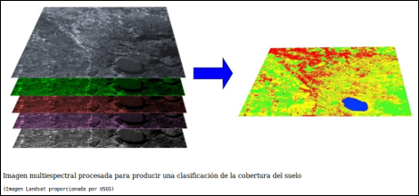
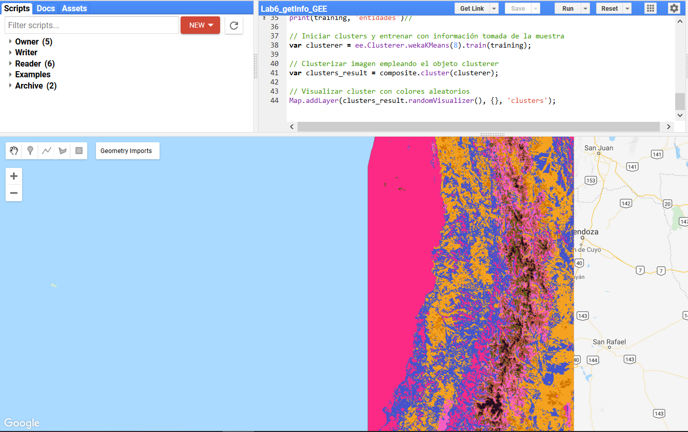
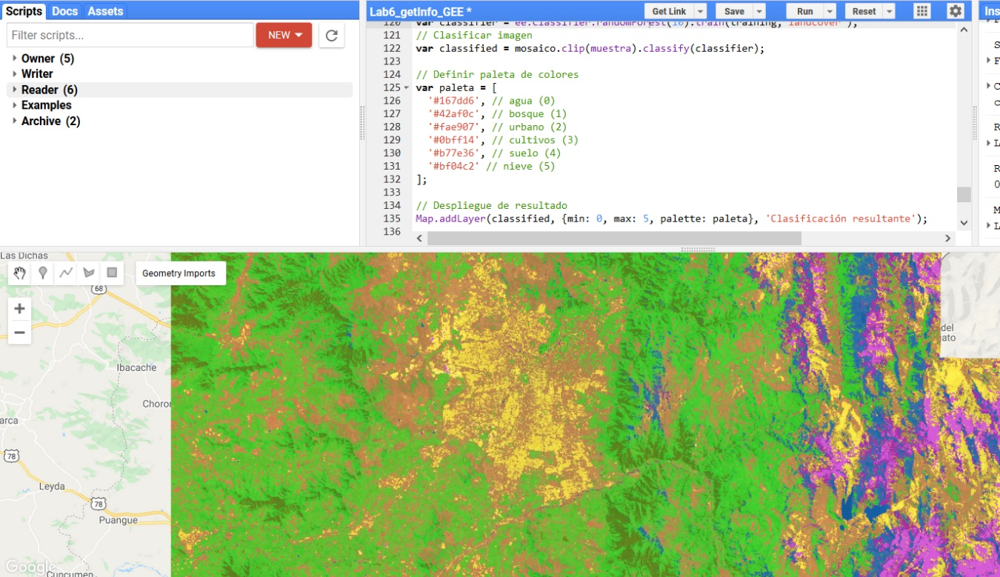
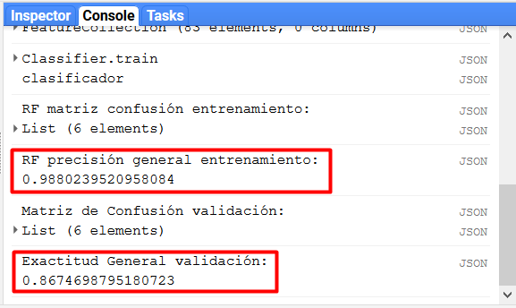

background-image: url(logo_labgrs_color.png)
background-position: center
background-size:40%

```{r setup, include=FALSE}
options(htmltools.dir.version = FALSE)
```


---
# Importando una colección de datos

--
- Dentro de GEE disponemos de una gran cantidad de información, que está agrupada en colecciones.

 
- Cada colección corresponde a un producto diferente, ya sea satelital, modelo climático, etc.

- Las colecciones van a considerar una estructura mínima similar a lo siguiente:

--
```{js}
var imageCollection = ee.ImageCollection('NOMBRE/PRODUCTO')
```

- De esta forma importaremos la colección de datos completa, y podemos imprimir la colección en la consola usando `print()`

---
# Insertar video de las colecciones

---
# Filtrando una colección

--
- Para poder visualizar solo la información que nos interesa o filtrar en base a criterios específicos (región de interés ,fechas, cobertura nubosa, etc.)

--
- GEE dispone de varias formas de filtrar que podemos emplear como: *filter()*, *filterBounds()*,
*filterDate()*, etc.

--
- Filtrar la información nos permitirá poder imprimir en la consola los resultados e inspecionarlos de forma más simple.

--
- Considere que en consola solo se puede imprimir hasta 5000 elementos, después de eso los resultados no se pueden ver en la consola, pero si estarán disponibles para analizar.

---
#Insertar video de filtro de colecciones

---
# Creando una imagen desde una colección

--
- Cada colección dispone de diferentes archivos dentro de ella, desde rasters individuales hasta archivos multibanda.

--
- Podemos crear una imagen empleando uno de los archivos dentro de la colección o podemos crear reducciones de toda la colección (cosa que veremos más adelante)

--
- *Importante*: Debemos tener en cuenta como se almacena la información y los nombres de las capas de información para seleccionar.

---
# Video de crear imagen y seleccionar bandas

---
# Exportando imagen desde GEE

--
- Al procesar la información dentro de GEE, podemos optimizar el uso de espacio y descargar solo los resultados o solo la imagen a una zona acotada de nuestro interés.

--
- Para exportar podemos hacerlo a un asset (dentro de la memoria de GEE), a Google Cloud o a Google Drive.

-- 
- En el caso de Google Cloud debemos considerar pago por uso de almacenamiento.

--
- En el caso de Gogole Drive y assets estamos limitados al espacio de cada plataforma.

---
#Insertar video de exportación


---
# Clasificación de imágenes

--
- Los procesos de clasificación se basan en asignar un *conjunto de píxeles en la imagen digital a un conjunto de clases*

--
- Responde a la idea de que pueden establecerse límites entre las respuestas espectrales de unos píxeles y otros.

--
- Estos límites son los que definen las clases.

--
- El resultado de una clasificación digital corresponde a un inventario de las categorías objeto de estudio.

--
.center[

]
---
# Métodos de clasificación

--
- Existen múltiples métodos para generar clases:
  * No estadísticos (mínima distancia, paralelepípedos).
  * Estadísticos clásicos (máxima probabilidad).

- Algoritmos basados en inteligencia artificial y machine learning:
    + Redes neuronales
    + Random Forest
    + Support vector machine
    
.center[

]

---
# Consideraciones

--
- Podemos disponer de métodos de clasificación *NO SUPERVISADOS* y *SUPERVISADOS*

--
- En el primer caso necesitaremos defnir inicalmente un número base de clases y seleccionar el algortismo de clasificación para obtener un resultado.

--
- Para el segundo caso, se deben considerar los siguientes pasos:
  + Generación de un conjunto de clases y sus respuestas espectrales características (definición
  digital de las áreas de entrenamiento).
  + Adjudicación de todos los píxel a alguna de las clases (fase de asignación).
  + Comprobación y verificación de resultados.
  
---
# Ahora en GEE

--
- En GEE disponemos de un número importante de funciones dedicadas al aprendizaje de máquinas (ML, Machine Learning en inglés) como ee.Classifier, ee.Clusterer o ee.Reducer, este último utilizado anteriormente. En los ejemplos que utilizaremos a continuación, veremos cómo emplear clasificación no supervisada y supervisada para imágenes multiespectrales.

--
- En el siguiente ejemplo realizaremos una clasificación no supervisada en base imágenes Landsat 8 Level 2 Surface Reflectance; entre 2018-01-01 / 2019-01-01

- Filtraremos a una zona de interés

--

```{js}
//Clasificación no supervisada
var collection = ee.ImageCollection('LANDSAT/LC08/C01/T1_SR')
 .filterDate('2018-01-01', '2019-01-01')
 .filterBounds(geometry);
 print(collection,'archivos disponibles')

```

---
# Creando mosaico base

--
- Para trabajar adecuadamente, crearemos un mosaico de la mediana de las bandas espectrales 1 - 7 (Coastal - SWIR2) 

- Añadiremos el resultado a la vista de mapa con una composición en falso color.

```{js}
// Selección de mínimo valor de pixel y ajuste a área de estudio.
var composite = collection.select('B1','B2','B3','B4','B5','B6','B7').median().clip(geometry);
// Selección de bandas para visualización.
var result = composite.select('B5', 'B4', 'B3');
Map.addLayer(result, {gain: '0.1, 0.1, 0.1'});

```

---
# Clasificación

Con nuestra imagen a clusterizar ya disponible, los siguientes pasos lógicos a implementar son los siguientes:
- Crear entidades que determinarán dónde encontrar los clusters.
- Iniciar la búsqueda de clusters a partir de esas entidades.
- Entrenar los clusters empleando la información de entrenamiento.
- Aplicar los clusters.
- Etiquetar opcionalmente la información.

--

```{js}
//Creación de entidades
var training = composite.sample({
  region: muestra,
  scale: 30,
  seed: 10,
  numPixels: 3000
});
print(training, 'entidades')

```

Recuerde definir su región de muestra, sino la selecciona todos los pixeles serán empleados.

---

--
- Con estas entidades, procederemos a entrenar nuestros clusters, aplicarlos sobre nuestro mosaico y visualizarlos en nuestra vista de mapa.

--

```{js}
// Iniciar clusters y entrenar con información tomada de la muestra
var clusterer = ee.Clusterer.wekaKMeans(8).train(training);
// Clusterizar imagen empleando el objeto clusterer
var clusters_result = composite.cluster(clusterer);
// Visualizar cluster con colores aleatorios
Map.addLayer(clusters_result.randomVisualizer(), {}, 'clusters',false);

```

.center[

]

---
# Clasificación supervisada

--
- como se mencionó anteriormente, para realizar una clasificación supervisada se requiere inicialmente de información conocida del lugar a analizar, ya sea, obtenida mediante campañas de terreno o a partir de fotointerpretación u otra información secundaria. Otro aspecto relevante es el algoritmo empleado para la realización del proceso de clasificación y la selección de la o las imágenes a clasificar.

--
- Haremos uso de imágenes Sentinel 2 (A/B) pertenecientes a la Agencia Espacial Europea (ESA, en inglés), que disponen de 13 bandas espectrales útiles para el mapeo de diferentes elementos tanto terrestres como acuáticos a diferentes resoluciones espaciales.

--
- Filtraremos las imágenes a un área de interés considerando menos de un 15% de nubosidad y que vayan entre septiembre de 2018 y febrero de 2019, generando un mosaido primavera verano de la mediana.

---
# código para selección

--

```{js}
//Clasificación supervisada
//    Seleccionar producto
// Indicar el ImageCollection ID
var producto = ee.ImageCollection('COPERNICUS/S2');//Sentinel 2
// Filtrar colección
var producto_filtrado = producto
    // Por área de estudio utilizando polígono de nombre muestra
    .filterBounds(muestra)
    //por rango de fechas
    .filterDate('2018-09-01', '2019-02-28')
    // por cobertura de nubes máxima – Sentinel 2
    .filterMetadata('CLOUDY_PIXEL_PERCENTAGE','less_than', 15);
// ver resultado para filtros aplicados
print("Coleccion seleccionada", producto_filtrado);

```

---
# Generando mosaico

--
- Seleccionaremos un conjunto de bandas para realizar nuestro mosaico
- Luego lo añadiremos a la vista de mapa

--

```{js}
// Definir bandas a seleccionar
var bandas = ['B2','B3','B4','B8','B11','B12'];
var mosaico = producto_filtrado.select(bandas).median();
// ver imagen en mapa:
Map.addLayer( mosaico.clip(muestra), {bands: ['B8', 'B4', 'B3'], min: [0,0,0], max:[2500,2500,2500] } , "S2 B8-B4-B3" );
// centrar en area de estudio
Map.centerObject(muestra);

```

--
Con nuestro mosaico listo, crearemos regiones de entrenamiento considerando las clases: agua, bosque, urbano, pradera, cultivos, suelo y nieve.

---
# Video de creación de features de entrenamiento

---
# Puntos de referencia

--
- Con nuestras entidades de entrenamiento listas, las fusionaremos en una sola entidad

--

```{js}
// Unir categorias
var clases = agua.merge(bosque).merge(urbano).merge(cultivos).merge(suelo).merge(nieve);
print(clases, 'clases')
```

---
# Entrenamiento y validación

--
- Separaremos los datos creados en dos conjuntos uno de entrenamiento y uno de validación.

--
- Para esto crearemos una columna adicional con la función *randomColumn()* en nuestro *FeatureCollection* que contenga números aleatorios para luego filtrar los conjuntos.

--
- Y haremos la extracción de información en nuestro mosaico para cada punto de entrenamiento generado.

--

```{js}
var seed = 100;
var clases = clases.randomColumn('random', seed);
print(clases,'clases');
//muestrear clases en la imagen de entrada para obtener información de entrenamiento
var training_data = mosaico.clip(muestra).sampleRegions({
  collection: clases,
  properties: ['random','landcover'],
  scale: 10
});
// Separación entre Entrenamiento y validación. Identificar umbral de separación
var training = training_data.filterMetadata('random', 'less_than', 0.7);
var testing = training_data.filterMetadata('random', 'not_less_than',0.7);

```

---
# Random Forest (Tumer & Ghosh, 1996)

--
- Ahora usaremos los datos de entrenamiento para crear nuestra clasificación  y añadiremos el resultado a nuestro mapa.

--

```{js}
// Clasificación RF 
var classifier = ee.Classifier.randomForest(10).train(training,'landcover');
// Clasificar imagen
var classified = mosaico.clip(muestra).classify(classifier);

```

--

```{js}
// Definir paleta de colores
var paleta = [
  '#167dd6', // agua (0)  
  '#42af0c', // bosque (1)
  '#fae907', // urbano (2)
  '#0bff14', // cultivos (3)
  '#b77e36', // suelo (4)
  '#bf04c2' // nieve (5)
];
// Despliegue de resultado
Map.addLayer(classified, {min: 0, max: 5, palette: paleta}, 'Clasificación resultante');

```

---
class: middle, center


---
# Validación de la clasificación

--
El paso final del toda clasificación supervisada consiste en evaluar la precisión del proceso.

--
- Consideraremos en este caso la precisión general del conjunto de entrenamiento y también calcularemos la precisión del conjunto de validación.

--

```{js}
classifier.confusionMatrix());
print('RF precisión general entrenamiento: ', classifier.confusionMatrix().accuracy());
/// Generación de matriz de confusión y resultados
var validation = testing.classify(classifier);
var errorMatrix = validation.errorMatrix('landcover', 'classification');
print('Matriz de Confusión validación:', errorMatrix);
print('Exactitud General validación:', errorMatrix.accuracy());

```

---
class: middle, center


---
background-image: url(logo_labgrs_color.png)
background-position: center
background-size:40%


