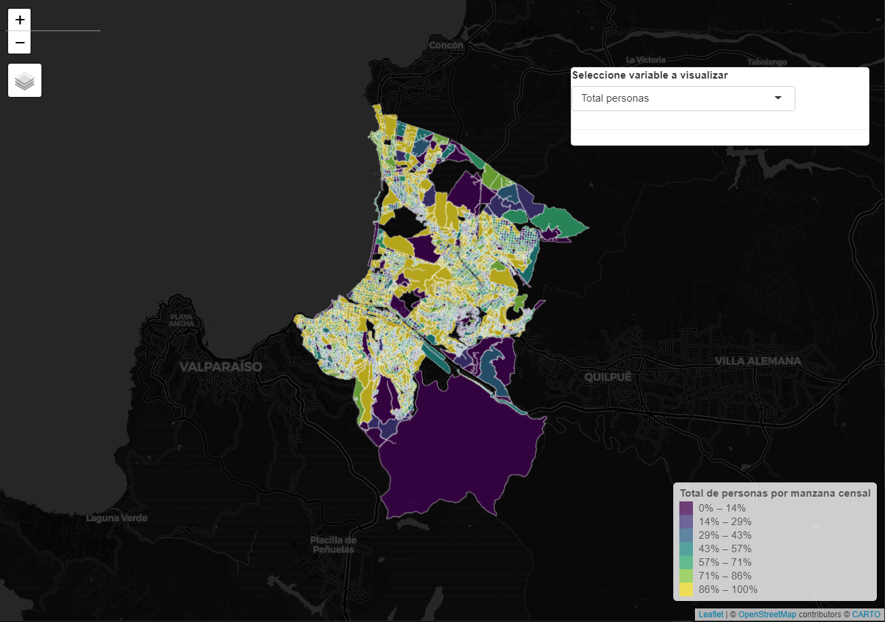
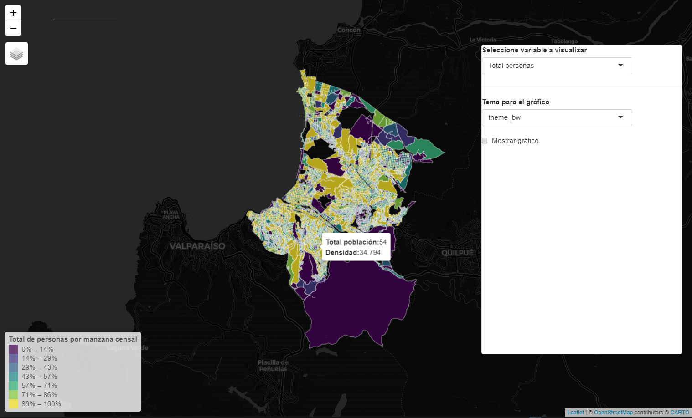

background-image: url(logo_labgrs_color.png)
background-position: center
background-size:40%

```{r setup, include=FALSE}
options(htmltools.dir.version = FALSE)
library(shiny)
library(leaflet)
library(tidyverse)
library(sf)
library(shinybusy)
```


---

Librerías utilizadas en esta sesión

```{r eval=F}
library(shiny)
library(leaflet)
library(htmltools)
library(tidyverse)
library(plotly)
library(sf)
```

---
#Creando funciones

--
- La creación de una función específica es útil para limpiar el código dentro de nuestra aplicación (siempre que se pueda)

--

> To understand computations in R, two slogans are helpful:
- Everything that exists is an object, and
- Everything that happens is a function call.

.footnote[John Chambers creador de R, en Advanced R (2019) 2da Edición, p. 79.]


---
#Creando la primera función 

--
- Las funciones auxiliares nos permiten modularizar código para ahorrar la carga sobre el script principal del server

--
- Nos permiten reutilizar código facilmente y optimizar el desarrollo y el debugging.

--
- El script de la función se verá de la siguiente manera, considerando la opción para plotear:

--
```{r eval=F}
dataPlot <- function(){
  
}
```

--
- Dentro de nuestras {} debemos generalizar y poner todo el código que queremos emplear para dar con nuestra salida.

---
# Aplicación

--
- Crearemos nuestra función sobre una aplicación con datos censales del año 2017 (INE) para la comuna de Viña del Mar

.center[

]

---
# Incorporando elementos en la UI

--
- Deberemos considerar en nuestra UI los elementos que nos permitiran controlar nuestro gráfico: *checkboxInput()* y *selectInput()* con los tipos de temas para nuestro gráfico.

--
- Nuestro server de momento no tendrá modificaciones.

```{r eval=F}
ui <- bootstrapPage(
  tags$style(type = "text/css", "html, body {width:100%;height:100%}"), #esto hace la magia
  leafletOutput(outputId = 'map', width = "100%", height = "100%"),
  absolutePanel(id="controls",
                style="z-index:500;", top = 90, left = "auto", right = 20, 
                bottom = "auto",
                width = 400, height ="auto",
                class = "panel panel-default",
                selectInput(inputId = 'campo',label = 'Seleccione variable a visualizar',
                            choices = list('Total personas' = 'PERSONAS',
                                           'Densidad (per/ha)'='DENSIDAD',
                                           'Viviendas'='TOTAL_VIVI')),hr(),
                selectInput(inputId = 'tipo',label = 'Tema para el gráfico', #<<
                            choices = c('theme_bw','theme_classic','theme_dark','theme_light')),#<<
                checkboxInput(inputId = 'plot',label = 'Mostrar gráfico',value = F),#<<
                plotlyOutput(outputId = 'histo',width = '100%')#<<
  )
)
```

---
class: middle, center



---
#Armando la función

--
- Para este ejemplo realizaremos una función gráfica que requerirá tres argumentos: *(1) campo*, *(2) shp* y *(3) tipo*

--
- Dentro simplemente armaremos un código genérico para un histogramy los condicionales necesarios para el tema del gráfico

--
```{r}
dataPlot <- function(datos , campo){
#base plot
  g <- ggplot(data = datos, aes_string(x = campo)) + geom_histogram() +
    xlab(campo) + ylab('Frecuencia')
  
  if(tipo == 'theme_bw'){
    g <- g + theme_bw()
  }
  if(tipo == 'theme_classic'){
    g <- g + theme_classic()
  }
  if(tipo == 'theme_dark'){
    g <- g + theme_dark()
  }
  if(tipo == 'theme_light'){
    g <- g + theme_light()
  }
  
  return(ggplotly(g))
}
```

--
- Este script lo guardaremos en el mismo directorio de la aplicación, con el nombre *dataPlot.R*

---
# Usando la función en nuestra app

--
- Para cargar la función usaremos `source('dataPlot.R')`, idealmente antes de la UI.

--
- Para renderizar el gráfico, crearemos un objeto reactivo empleando *eventReactive()*

--
- Esta vez consideraremos tres inputs reactivos que pueden modificar mi gráfico usando `c(input$tipo, input$plot, input$campo)`
- Además la función solo se ejecutará si nuestro *checkboxInput()* se encuentra clickeado.

```{r eval=F}
  graf <- eventReactive(c(input$tipo, input$plot, input$campo),{
    req(input$campo)
    if(input$plot != F){
      dataPlot(datos = shp,campo = input$campo, tipo= input$tipo)
    }
  })
```

--
- Render del plot, empleando *req(!is.null(graf()))* para evitar que se genere un render cuando *graf()* sea igual a NULL

```{r eval=F}
output$histo <- renderPlotly({
    req(!is.null(graf()))
    graf()
  })
```

---
class: middle, center


---
background-image: url(logo_labgrs_color.png)
background-position: center
background-size:40%


