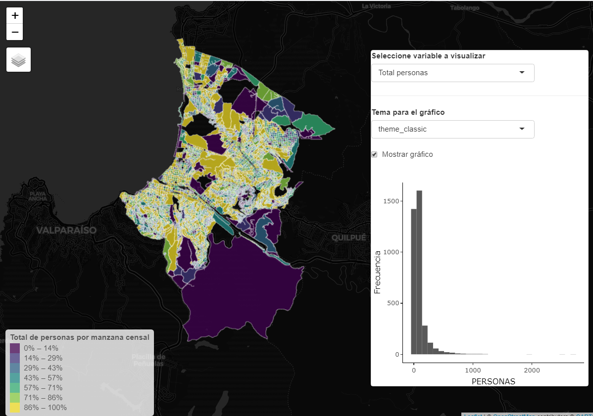

background-image: url(logo_labgrs_color.png)
background-position: center
background-size:40%

```{r setup, include=FALSE}
options(htmltools.dir.version = FALSE)
library(shiny)
library(leaflet)
library(tidyverse)
library(sf)
library(shinybusy)
```


---

Librerías utilizadas en esta sesión

```{r eval=F}
library(shiny)
library(leaflet)
library(tidyverse)
library(sf)
library(shinybusy)
```


---
class: inverse, center, middle

# INTRODUCCIÓN

---
#Creando funciones

--
- La creación de una función específica es útil para limpiar el código dentro de nuestra aplicación (siempre que se pueda)

--

> To understand computations in R, two slogans are helpful:
- Everything that exists is an object, and
- Everything that happens is a function call.

.footnote[John Chambers creador de R, en Advanced R (2019) 2da Edición, p. 79.]


---
#Creando la primera función 

--
- Las funciones auxiliares nos permiten modularizar código para ahorrar la carga sobre el script principal del server

--
- Nos permiten reutilizar código facilmente y optimizar el desarrollo y el debugging.

--
- El script de la función se verá de la siguiente manera, considerando la opción para plotear:

--
```{r eval=F}
dataPlot <- function(){
  
}
```

---
#Armando la función

--
- Para este ejemplo realizaremos una función gráfica que requerirá dos argumentos: *(1) campo* y *(2) shp*

--
- Dentro simplemente armaremos un código genérico para un histograma.

--
```{r}
dataPlot <- function(datos , campo){

  ggplot(data = datos, aes_string(x = campo)) + geom_histogram() + theme_bw() +
    xlab(campo) + ylab('Frecuencia')
}
```

--
- Este script lo guardaremos en el mismo directorio de la aplicación, con el nombre *dataPlot.R*

---
# Usando la función en nuestra app

--
- Para cargar la función usaremos `source('dataPlot.R')`, idealmente antes de la UI.

--
- Luego renderizaremos nuestro gráfico

```{r eval=F}
  output$grafico <- renderPlot({
      req(input$plot)
      campo <- isolate({input$campo[[1]]})
      dataPlot(datos = shp,campo = campo)
  })
```

---
class: middle, center

---
class: inverse,center, middle

# ¿PREGUNTAS?


---

class: inverse,center, middle

# PRÓXIMA SEMANA SEGUIMOS <br> MEJORANDO NUESTRA APP <br> 

